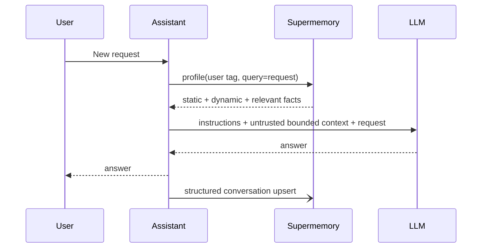

# Agent architectures and build ideas

The central design choice is not “does the agent have memory?” It is **which facts enter
memory, who can revise them, which representation is retrieved, and what happens when the
memory path fails**.

## Reusable primitives and live multi-provider agents

This repository implements four framework-independent patterns in
[`agents.py`](../src/supermemory_lab/agents.py) and a live driver in
[`run_agent_patterns.py`](../examples/run_agent_patterns.py).

| Pattern | Writes | Reads | Best for |
|---|---|---|---|
| `PersonalizedAgent` | Best-effort structured conversation | Profile plus query recall | Personal assistants, tutors, support copilots |
| `ResearchNotebookAgent` | `superrag` sources with stable IDs | Hybrid, reranked evidence | Research, policy, document Q&A |
| `HandoffBoard` | Exact dynamic facts with task/agent metadata | Aggregate memory recall | Multi-agent workflows and resumable jobs |
| `DecisionJournal` | Exact static decisions; versioned revisions | Memories plus relations/documents | Architecture, product, operational decisions |

These patterns intentionally avoid tying memory to an orchestration framework. Any agent
runtime can call them.

Five additional production-shaped implementations cover competitive intelligence, dynamic
tool selection, sandboxed debugging, support continuity, and release memory. See
[Practical multi-provider agents](practical-agents.md) and the
[provider combination map](provider-combinations.md).

## Architecture 1: personalized chief of staff

**Goal:** retain working style, projects, commitments, and recent activity across sessions.

Write explicit settings directly when the user saves them. Ingest normal dialogue
asynchronously and expose a “what I remember” review screen. Use one opaque per-user
container, preferably enforced by a scoped key in a user-controlled environment.

Failure policy: the assistant can answer without a write; whether it can answer without a
profile depends on the request. Never claim to remember something when profile retrieval
failed.

High-value extensions:

- calendar/email connector summaries kept separate from user traits;
- commitment extraction with an application-owned reminder scheduler;
- profile buckets for communication, accessibility, work style, and current goals;
- a user-approved “promote to durable preference” action.

## Architecture 2: cited research notebook

**Goal:** answer from a corpus while retaining provenance and avoiding accidental profile pollution.

Ingest each source with `taskType=superrag`, a deterministic `customId`, source URL, author,
publication date, and corpus version. Search hybrid so exact source wording can accompany
distilled facts. The answer prompt must require citations and a missing-evidence statement.

For long research tasks, maintain two containers:

- `research:{project}:sources` for documents and citations;
- `research:{project}:decisions` for analyst-confirmed findings and hypotheses.

Supermemory currently takes one v4 container per search. Query the two scopes separately in
trusted code and label their context differently rather than weakening isolation.

Failure policy: if source recall fails, do not improvise an answer. Return the gap and retry.

## Architecture 3: multi-agent handoff blackboard

**Goal:** let planner, researcher, coder, tester, and reviewer resume one another's work.

Publish only compact, confirmed handoffs: task, result, status, artifact pointer, confidence,
and author agent. Use exact direct memories so the board does not depend on extraction.
Retrieve an aggregate for orientation, then fetch underlying results when a decision requires
provenance.

Keep locks, task assignment, retries, and completion status in a transactional workflow
store. Memory answers “what did the agents learn?”; the orchestrator answers “who owns the
task and may transition it?”

Useful memory kinds:

- `observation`: source-backed fact;
- `decision`: accepted choice;
- `attempt`: failed approach and why;
- `handoff`: next agent input;
- `artifact`: immutable URL/commit/file identifier;
- `open_question`: unresolved uncertainty.

Failure policy: a failed board write makes the handoff incomplete. Do not mark the workflow
step complete until the durable orchestration record and memory note are reconciled.

## Architecture 4: versioned decision journal

**Goal:** preserve the current decision and how it changed.

Write accepted decisions directly with owner, date, scope, and source artifact. When a
decision changes, use memory update rather than appending a contradiction. Retrieve related
memories and source documents for a review or architecture question.

Keep approval status and policy enforcement in the application database. The journal is a
context and discovery layer, not the formal signature record.

Failure policy: the canonical decision remains available from the system of record; memory
degradation only reduces semantic discovery.

## Twelve more practical agent products

### 5. Customer-support continuity agent

Store product environment, communication preferences, prior troubleshooting outcomes, and
unresolved issues per customer. Ingest ticket transcripts; keep product manuals in a shared
RAG container queried separately. A support response combines customer profile, open cases
from the ticket database, and cited product knowledge.

Key risk: tickets contain PII and malicious text. Add retention controls, prompt boundaries,
and explicit tenant derivation. Never let remembered refund language authorize a refund.

### 6. Coding repository historian

Capture accepted implementation choices, failed debugging paths, repo conventions, and
handoffs. Index ADRs and selected docs with `superrag`. The official coding plugins demonstrate
periodic capture and project/user scopes, but an internal implementation can require an
explicit review before durable writes.

Best payoff: fewer repeated investigations and better cross-session onboarding. Store commit
SHAs/file paths so every memory can be grounded against current code.

### 7. Incident-response copilot

Use a per-incident container for timeline facts and a service container for runbooks. Agents
write exact observations (“metric crossed threshold at time T”) and versioned hypotheses.
Hybrid search retrieves runbook wording and prior incident patterns.

The paging system, incident state, and commands remain authoritative elsewhere. Retrieved
shell commands must never execute without policy and human approval.

### 8. Account-intelligence agent

Connect email, meeting notes, and approved CRM exports. Maintain a profile of stakeholders,
goals, objections, and recent changes. Use reviewable inferences for relationship guesses.

Keep pipeline amounts, consent, and contact permissions in the CRM. Use metadata for region,
account, and source type inside a tenant container. This is a strong connector use case only
after entitlement and deletion tests pass.

### 9. Adaptive tutor

Remember demonstrated mastery, misconceptions, examples that worked, pace, and accessibility
preferences. Directly write only assessed outcomes; ingest conversations for candidate
signals. Use a custom profile bucket taxonomy by subject and skill.

The tutor can select the next explanation from memory, while a deterministic curriculum
engine owns prerequisites and scoring. Add decay/reassessment rather than assuming old
mastery is permanent.

### 10. Personal knowledge inbox

Capture browser saves, documents, and notes into topic/project containers. Use hybrid search
for question answering, the memory graph UI for exploration, and SMFS for agents that already
work through files. Promote only user-approved conclusions to a decision container.

The strongest differentiator is not saving links; it is allowing multiple agents to share the
same reviewed personal context across tools.

### 11. Compliance and policy change analyst

Ingest versioned regulations and internal policies as SuperRAG sources. Write analyst-approved
obligations directly and revise them when source versions change. Retrieve raw chunks for
every conclusion.

Use deterministic effective dates and jurisdiction filters. Memory can surface potential
changes but cannot establish legal compliance. Require human review and preserve the source
snapshot outside Supermemory.

### 12. Recruiting interview continuity agent

Index role rubrics and approved candidate materials; capture structured interview evidence
with interviewer/source metadata. Use memory search to avoid repeated questions and hybrid
search for rubric grounding.

Do not create or rely on inferred sensitive traits. Define short retention, access logging,
and deletion before ingestion. Keep hiring decisions in the ATS.

### 13. Product discovery synthesizer

Ingest interviews as sources; derive query-specific themes with aggregate search; write only
reviewed findings and product decisions directly. Profile buckets can represent user segment,
jobs, constraints, and desired outcomes, but generated buckets should be reviewed for bias.

Use source IDs and timestamps so a theme can be traced to interviews rather than becoming a
free-floating “customer fact.”

### 14. Workflow automation learner

Remember which tool sequence succeeded for a user, common failure reasons, and preferred
formats. Store exact successful recipes only after a validated run. Search past attempts before
planning a new automation.

Tool credentials, scopes, and authorization remain in the automation platform. A remembered
recipe is input to planning, never permission to call a tool.

### 15. Voice-agent relationship memory

Pipecat/Cartesia integrations make asynchronous conversational memory attractive for voice
support, coaching, or concierge apps. Profile-first retrieval can happen before the call and
conversation ingestion after each segment.

Latency is stricter than chat: prefetch a small profile, never wait for extraction on the audio
turn path, and benchmark wrapper regressions. Obtain recording/transcription consent.

### 16. Sandbox-native research/coding agent with SMFS

Mount a project container in E2B or another long-lived sandbox, or expose the serverless Bash
tool. The agent can `cat profile.md`, write a reviewed `memory.md`, and semantic-grep the
container with familiar shell operations.

Use it when filesystem grammar materially simplifies the agent. Do not present the virtual
Bash tool as arbitrary code execution, and account for sync/eventual-consistency behavior.

## Choosing the correct write path

| Input | Write path | Reason |
|---|---|---|
| Explicit user preference saved in settings | Direct static memory | Confirmed and normalized. |
| Casual conversation | Structured conversation | Extraction should decide salience. |
| Research paper or policy PDF | `superrag` document | Preserve wording and citations; avoid traits. |
| Approved project decision | Direct static memory | Must be exact; use profile or an explicit search-visibility barrier for immediate handoff. |
| Current task status | Direct dynamic memory or application DB | Exact, short-lived; DB remains authoritative. |
| Agent hypothesis | Direct dynamic with `status=hypothesis`, or do not persist | Prevent it masquerading as truth. |
| Correction to known fact | Versioned update | Preserve history and current truth. |
| “Forget everything about topic X” | Dry-run mass-forget, review, async execute | Natural-language deletion is probabilistic. |

## A memory quality loop

Every serious deployment should implement:

1. **Observe:** log query, selected memory IDs, scores, server/client latency, and context tokens.
2. **Evaluate:** sample answers for correctness, source support, stale facts, missed recall, and leakage.
3. **Review:** expose inferred and low-confidence facts to users/operators.
4. **Correct:** update, forget, or re-ingest using stable IDs.
5. **Regress:** replay a fixed domain dataset before SDK/config/model upgrades.

This loop is more valuable than continually increasing `limit` or lowering the threshold.
