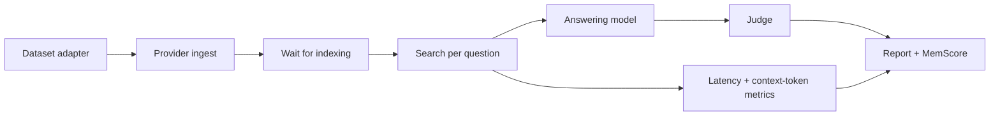

# MemoryBench, MemScore, and evaluation strategy

## What MemoryBench actually is

[MemoryBench](https://github.com/supermemoryai/memorybench) is an open TypeScript/Bun
framework that standardizes a pipeline:



The inspected snapshot supports LoCoMo, LongMemEval, and ConvoMem-style datasets and provider
adapters for Supermemory, Mem0, Zep, filesystem, and baseline RAG. It checkpoints stages and
can serve a local results UI.

That is useful infrastructure, but “same framework” does not automatically mean “neutral
comparison.” Provider adapters, prompts, indexing waits, retrieval limits, model versions,
and judge behavior remain experimental choices.

## MemScore

The official [MemScore spec](https://supermemory.ai/docs/memorybench/memscore) reports a triple:

```text
accuracy% / mean-search-latency-ms / mean-retrieved-context-tokens
```

This is materially better than one accuracy number. It makes an obviously slow, context-heavy
system visible instead of rewarding it for eventually finding the answer.

Still record more than the triple:

- latency p50/p95/p99 and timeout rate, not only mean;
- ingest/index duration and failure rate;
- direct provider cost plus answering/judge cost;
- citation/support rate and stale-fact rate;
- deletion, isolation, and correction behavior;
- user/business task success.

## Source inspection of the Supermemory adapter

At commit
[`118209a`](https://github.com/supermemoryai/memorybench/tree/118209a746d97d0d85e5a7234267f0b6962857e9),
the adapter:

- ingests each session as a dated, escaped document;
- polls both document and memory state before searching;
- uses v4 hybrid search;
- retrieves up to 30 results;
- uses an effective threshold of `options.threshold || 0.3`, meaning an explicit zero is
  replaced by 0.3;
- includes a legacy chunks flag alongside hybrid mode;
- does not implement provider cleanup;
- has high provider concurrency knobs: default 50, ingest 100, and indexing 200 in the
  inspected adapter.

These are not necessarily wrong settings, but they define the result. The unimplemented
cleanup also means benchmark containers can accumulate. Use a dedicated organization/key and
explicit cleanup plan.

The inspected judge integrations expect direct OpenAI, Anthropic, or Google SDK credentials.
The supplied OpenRouter key is not a drop-in judge configuration in that commit. This lab did
not silently use unrelated ambient credentials or patch the benchmark and then call it an
official run. A full benchmark remains pending an authorized compatible judge key or a
reviewed upstream OpenRouter adapter.

## Why headline numbers conflict

Several public numbers called “Supermemory on LongMemEval” are not the same metric/setup:

- the main repository has published an 81.6% LongMemEval answer score with GPT-4o;
- Supermemory's current [LongMemEval research page](https://supermemory.ai/research/longmembench/)
  highlights 95% Recall@15 with aggregation and about 720 mean retrieved tokens;
- competitor Hindsight's public
  [benchmark repository](https://github.com/vectorize-io/hindsight-benchmarks) lists an 81.6%
  Supermemory/GPT-4o answer score while newer competitor pages cite 85.2% with another setup;
- the ~99% ASMR result was a deliberately impractical demonstration, later explained by the
  Supermemory founder as a benchmark-reporting lesson.

Recall@15, judged answer accuracy, different answering models, different dates, aggregation,
and different context budgets are not interchangeable. Never put these numbers in one ranking
without the exact dataset split, code commit, provider config, model snapshot, prompt, judge,
latency definition, and token calculation.

The original [LongMemEval paper](https://proceedings.iclr.cc/paper_files/paper/2025/file/d813d324dbf0598bbdc9c8e79740ed01-Paper-Conference.pdf)
is the primary source for what the benchmark measures. It is valuable for long-term
conversation recall, knowledge updates, temporal reasoning, and multi-session questions. It
does not establish tenant safety, prompt-injection resilience, operational durability, or the
business value of remembered context.

## A defensible provider comparison

When a compatible judge key is authorized:

1. Pin MemoryBench commit, provider SDK version, and answer/judge model snapshots.
2. Use a fresh dedicated container prefix and record plan/region.
3. Set all concurrency and thresholds explicitly.
4. Run one small smoke slice to confirm ingest/search/cleanup behavior.
5. Run at least two public benchmarks, as MemScore's design recommends avoiding single-set overfit.
6. Repeat failed/time-out questions; do not silently discard them.
7. Archive raw checkpoints, report JSON, prompts, and cost.
8. Compare the exact same run path for every provider.
9. Report quality, latency distribution, context tokens, ingest time, and failures together.
10. Re-run after material SDK, extraction, retrieval, or answer-model changes.

Example upstream command shape (verify against the pinned CLI help first):

```bash
bun run src/index.ts run \
  --provider supermemory \
  --benchmark longmemeval \
  --judge gpt-4o \
  --run-id supermemory-YYYYMMDD
```

## The benchmark that matters for this project

Build a small domain suite before spending heavily on a public leaderboard. A useful first
set is 100 questions across 20 synthetic users/projects:

| Category | Cases | What it tests |
|---|---:|---|
| Stable personal fact | 10 | Profile extraction and simple recall |
| Recent/dynamic event | 10 | Recency and profile separation |
| Knowledge update | 15 | Old fact suppression and version history |
| Temporal reasoning | 10 | Dates and sequence |
| Cross-source multi-hop | 10 | Combining memories/chunks |
| Source-verbatim/citation | 10 | Hybrid retrieval and provenance |
| Distractor rejection | 10 | Precision at chosen threshold |
| Forget/correction | 10 | Lifecycle correctness |
| Tenant negative control | 10 | Isolation leakage |
| Prompt-injection source | 5 | Context boundary and tool safety |

For every question capture:

- expected answer and acceptable aliases;
- required/forbidden source IDs;
- retrieved IDs and context text;
- retrieval and answer latency;
- context tokens;
- final answer and judge rationale;
- whether memory was required, helpful, irrelevant, stale, or unsafe.

## Six release gates

A memory setup should not ship merely because average accuracy improved. Require:

1. **No tenant leakage** in deterministic negative controls.
2. **No action-policy bypass** from retrieved instructions.
3. **Knowledge-update pass rate** above the product's agreed floor.
4. **p95 latency** within the interaction budget, including the client path.
5. **Context-token ceiling** with no unbounded aggregate/full-document injection.
6. **Correction/deletion verification** across source, extracted memory, and caches.

The first field-lab probes establish the harness and several invariants, not a domain accuracy
score. That is an honest baseline from which a six-month evaluation program can grow.
