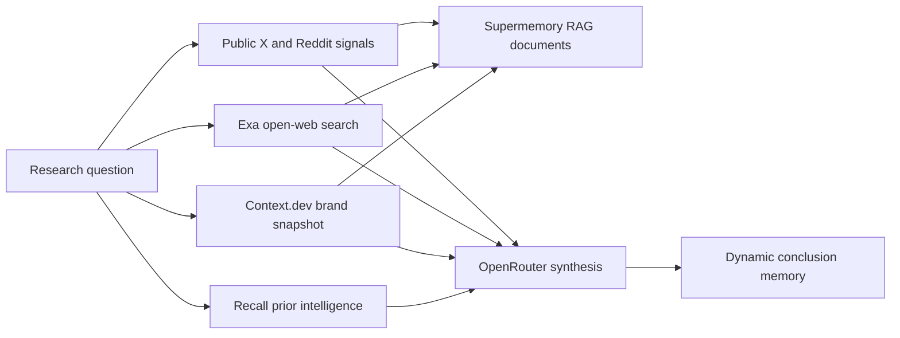

# Practical multi-provider agents

This chapter is the executable part of the wiki. The foundational implementations live in
[`advanced_agents.py`](../src/supermemory_lab/advanced_agents.py); live orchestration is in
[`run_advanced_agents.py`](../experiments/run_advanced_agents.py). Curated results are in the
[multi-provider](../evidence/2026-07-16-multi-provider-agents.md),
[second-pass](../evidence/2026-07-16-second-pass-agents.md), and
[lifecycle/Router/domain](../evidence/2026-07-16-third-pass-lifecycle-and-benchmark.md)
evidence notes. The latest five systems are in the
[fourth-pass evidence](../evidence/2026-07-16-fourth-pass-agent-systems.md) and the five
operational systems are in the
[fifth-pass evidence](../evidence/2026-07-16-fifth-pass-operational-agents.md). Newer agents are
split into focused modules so their safety boundary can be tested independently. The newest
six are covered by the
[sixth-pass deep-agent evidence](../evidence/2026-07-16-sixth-pass-deep-agents.md). The
Dreaming matrix and five newest operational implementations are covered by the
[seventh-pass evidence](../evidence/2026-07-16-seventh-pass-deep-operations.md).
The six eighth-pass agents are covered by the
[practical-agent expansion evidence](../evidence/2026-07-17-eighth-pass-practical-agent-expansion.md).

The current controllers require an injected authorization ledger for every governed durable
mutation. Unit tests and synthetic runners use `TestingAuthorizationLedger`; production must
inject a transactional externally issued ledger such as the SQLite reference or a distributed
equivalent. Archived hosted observations prove provider behavior, not human identity or approval.

## Run them

```bash
set -a
source .env.local
set +a
export PYTHONPATH=src:.

python experiments/run_advanced_agents.py intelligence
python experiments/run_advanced_agents.py tools
python experiments/run_advanced_agents.py release
python experiments/run_advanced_agents.py debug
python experiments/run_advanced_agents.py continuity
python experiments/run_safe_tool_execution.py
python experiments/run_governance_scorecard.py
python experiments/run_signal_radar.py
python experiments/run_retrieval_policy_grid.py
python experiments/run_release_triage_rehearsal.py
python experiments/run_evolving_preference_agent.py
python experiments/run_filter_erasure_agent.py
python experiments/run_lifecycle_agents.py
python experiments/run_router_continuity_matrix.py
python experiments/run_domain_memory_benchmark.py
python experiments/run_enterprise_context_agent.py
python experiments/run_corroborated_research_swarm.py
python experiments/run_adaptive_model_router.py
python experiments/run_temporal_agenda_agent.py
python experiments/run_dependency_risk_guardian.py
python experiments/run_governed_memory_curator.py
python experiments/run_resumable_agent_workcell.py
python experiments/run_relationship_account_briefing.py
python experiments/run_incident_forensics_agent.py
python experiments/run_tool_economics_portfolio.py
python experiments/run_graph_review_steward.py
python experiments/run_decision_council.py
python experiments/run_adaptive_tutor.py
python experiments/run_due_diligence_campaign.py
python experiments/run_change_risk_board.py
python experiments/run_retention_controller.py
python experiments/run_dreaming_review_matrix.py
python experiments/run_memory_transparency_agent.py
python experiments/run_contract_drift_sentinel.py
python experiments/run_project_memory_os.py
python experiments/run_adversarial_dissent_council.py
python experiments/run_migration_reconciler.py
python experiments/run_meeting_commitment_steward.py
python experiments/run_memory_intake_firewall.py
python experiments/run_tool_apprenticeship_agent.py
python experiments/run_memory_quality_auditor.py
python experiments/run_least_privilege_worker.py
python experiments/run_all_provider_readiness_commander.py
python experiments/run_framework_integration_contract_matrix.py
```

Raw traces go to ignored `.runs/` files. They contain bounded experiment details but should
still be treated as private operational data. The recorder redacts credential-shaped fields
and values; it is not a general-purpose PII anonymizer.

## The placement rule

Do not put everything into one vector index. Choose the representation from the information's
lifecycle.

| Information | Supermemory representation | Why |
|---|---|---|
| Confirmed identity, policy, durable preference | Direct static memory | Profile foundation; changes rarely. |
| Incident state, active project, current plan | Direct dynamic memory | Current context that should evolve or be superseded. |
| Web page, social payload, deployment snapshot, report | Document with `taskType=superrag` | Preserve source text and provenance for RAG. |
| Complete chat turn sequence | v4 conversation | Preserve roles and conversation identity. |
| Tool output needed only inside one turn | Local trace/cache | Avoid polluting long-term memory. |
| Verified lesson from a successful action | Dynamic memory with test/evidence metadata | Transfer proven knowledge to later tasks. |
| Model speculation or unverified social claim | Do not promote to static memory | Prevent compounding hallucinations. |

## 1. Competitive-intelligence agent

Providers: Supermemory + Context.dev + Exa + ScrapeCreators + OpenRouter.



Use it for competitor briefs, investment watchlists, sales account research, category maps,
and recurring market digests. The split is important:

- Context.dev gives a structured first-party brand baseline.
- Exa finds broader evidence with explicit per-query cost reporting.
- ScrapeCreators supplies public social signals; those signals are noisy and temporal.
- Raw payloads remain citable RAG evidence.
- Only the analyst conclusion becomes temporal memory, with capture time and subject metadata.

Production upgrades:

- Use stable source IDs and update existing documents when a source is recrawled.
- Add claim-level corroboration: one first-party source or two independent secondary sources.
- Store a confidence and invalidation condition with every promoted conclusion.
- Diff snapshots before invoking the model; do not pay to summarize unchanged data.
- Use Context.dev monitors for high-value domains only after measuring monitor-credit economics.

## 2. Tool-selection agent

Providers: Supermemory + Monid + Composio + OpenRouter.

The agent searches two catalogs, inspects Monid candidates, falls back to a known Composio
toolkit if natural-language search returns nothing, filters for mutation risk, and remembers
the recommendation. It deliberately does not execute a candidate during discovery.

The first tool-selection run saw the decision in profile but missed it in hybrid search for
ten seconds. A later controlled matrix corrected the initial interpretation: short, medium,
and long exact canaries were visible through profile, memories, and hybrid on their first
reads. The long original natural-language tool request still missed at every tested threshold,
while exact-tail and shorter semantic queries hit. Treat this as query sensitivity, not proven
indexing lag. Use a canary/read barrier when strict read-after-write behavior matters and tune
the actual production query distribution.

Use it for agents that choose among rapidly changing integrations. Store the user intent,
side-effect class, candidate schema/auth/price, rejection reasons, selected version, expiry,
and whether execution needs human approval.

Before real execution:

1. Inspect the exact input schema and price.
2. Classify it as read, reversible write, destructive write, or external message.
3. Pin a tool version when available.
4. Dry-run or validate inputs where available.
5. Require an idempotency key for retryable writes.
6. Persist the outcome only after provider confirmation.

Monid's inspected input contract is under top-level `input` (`pathParams` and `queryParams`),
not `inputSchema`. Its nested price shape is `price.amount.value` plus currency and per-call
type. Adapters should preserve the provider schema rather than normalizing guessed fields.

## 3. Sandboxed debugging agent

Providers: Supermemory + SuperServe + OpenRouter.

This is the strongest causal experiment in the lab. Generated code ran inside an ephemeral
Firecracker-backed sandbox with all IPv4 egress denied. A verified project policy was saved
after the first patch passed. On a related hidden test, the stateless patch failed and the
patch given the remembered policy passed.

Use the pattern for code repair, dependency upgrades, organization-specific data cleaning,
migrations, incident runbooks, and review of untrusted snippets.

Safety requirements:

- Use an explicit language template; live `superserve/base` lacked `python3` despite the
  inspected OpenAPI description.
- Deny network by default and allow only required hosts.
- Never inject provider credentials as plain environment variables into generated-code sandboxes.
- Bound runtime, capture exit code separately from HTTP status, and always delete the VM.
- Persist only lessons backed by passing tests, not the model's initial theory.

## 4. Support-continuity agent

Providers: Supermemory + OpenRouter.

The agent stores verified facts in a tenant container and retrieves a combined static/dynamic
profile before answering. The live synthetic benchmark covered a maintenance window, active
project transition, and privacy policy: memory scored 3/3; empty tenants scored 0/3.

This is better than replaying every ticket:

- durable entitlements and communication preferences become static profile facts;
- open incident state and the active project become dynamic facts;
- manuals, policies, and old ticket bodies remain RAG documents;
- sensitive raw logs stay outside long-term memory unless explicitly governed;
- deletion requests map to precise forget operations in the customer's container.

Add authorization before retrieval. A container tag is an isolation primitive, not proof that
the caller may access the tenant.

## 5. Release-memory agent

Providers: Supermemory + Vercel + OpenRouter.

The implementation performs only reads: list projects and recent deployments, reduce the
response to bounded fields, distinguish observed state from unavailable root-cause evidence,
and store the snapshot as a RAG document.

Useful extensions include fetching build logs only for failures, correlating failure signatures
with verified remediation memories, versioning SLO changes, and requiring approval before any
rollback, redeploy, alias change, or production promotion.

## 6. Safe public-tool execution agent

Providers: Monid + Composio + Supermemory.

This agent closes the gap between catalog discovery and verified execution without granting
general tool authority. It executes only exact allowlisted identifiers. A Monid candidate must
inspect as `GET`, expose a numeric price under the configured cap, and return successful status.
A Composio candidate must be on the exact allowlist, report `no_auth=true`, and contain no
mutation verb token. Public outputs are stored as untrusted RAG documents; the re-inspection
policy becomes a dynamic memory.

Live result: DefiLlama's Bitcoin price endpoint executed at $0.001/call, the no-auth Hacker
News tool returned three stories, and all three Supermemory writes were accepted. This is a
read-only proof, not permission to enable arbitrary marketplace tools.

## 7. Memory-governance and injection-resistant agent

Providers: Supermemory + OpenRouter.

The 15-case scorecard covers three knowledge updates, three precise forgets with retained
controls, four isolation pairs, and five attacker-controlled documents. Every lifecycle case
checks profile, memories, and hybrid. The injection agent quotes memory as untrusted data and
can answer factual questions, but `action_authorized` is always computed as `False` in trusted
code. Even a compromised model response cannot flip it.

The live score was 15/15. All update/forget/isolation observations passed on the first read;
all malicious documents were actually retrieved, but the answers retained the SEV-2 fact,
denied action, and omitted the attacker's requested token. This is a small synthetic gate,
not proof against arbitrary prompt injection.

## 8. Longitudinal developer-signal radar

Providers: Composio Hacker News + Exa + ScrapeCreators Reddit/X + Supermemory + OpenRouter.

The fresh cycle triangulates public sources, saves each payload as RAG evidence, synthesizes
a dated briefing, and stores the conclusion as dynamic memory. The fallback cycle disables
all external providers, retrieves the prior run, and adds a deterministic application banner:
`MEMORY-ONLY FALLBACK — freshness has not been verified`.

The first live HN request used the full research question and returned zero hits. Passing a
compact source-specific query returned 6 HN hits, alongside 6 Exa, 7 Reddit, and 8 X signals.
This is why source adapters need query strategies rather than one universal prompt.

## 9. Empirically tuned recall agent

Providers: Supermemory + OpenRouter.

The policy tuner executes 120 searches: 24 combinations of memories/hybrid, threshold
0/.5/.7, rerank on/off, and rewrite on/off against three positive and two negative queries.
It ranks exact correctness, false positives, false negatives, p95 latency, response size, and
then operational simplicity. The selected policy is stored as a dated dynamic memory.

The reproducible winning run selected `memories`, threshold `.7`, rerank off, rewrite off:
4/5, zero false positives, about 658 ms median and 784 ms p95. It missed one free-form
paraphrase. A trusted domain prefix recovered the real agent question without lowering the
threshold; the final answer correctly preserved allowlist and code-level authorization rules.
Do not copy this policy to another corpus without rerunning the grid.

## 10. Release-triage rehearsal agent

Providers: Vercel + Supermemory + OpenRouter + SuperServe.

The agent reads real Vercel counts and state only, stores a bounded snapshot, retrieves a
static webhook-security runbook, and patches a deliberately broken verifier in an
egress-blocked disposable sandbox. Production observation and synthetic rehearsal carry
explicitly different labels.

The first generated patch fixed stale timestamps but still accepted future timestamps. One
test-guided repair then passed all four tests. Only the passing result became a direct lesson;
an unverified result would remain RAG failure evidence. The sandbox was deleted and no Vercel
write endpoint was called.

## 11. Correction-aware personalization agent

Providers: Supermemory + OpenRouter.

This agent keeps the role-preserving conversation as a source document, but explicitly writes
only confirmed, normalized preferences to direct memory. A correction updates the existing
memory ID so the old value becomes history rather than a competing fact. It configures an
entity context and custom profile buckets, answers from profile plus search, and checks replay
idempotency and a second-container negative control.

The final live run passed correction, custom-bucket classification, idempotency, isolation,
and cleanup. Conversation processing completed without yielding the expected preference fact
inside 30 seconds, so the production pattern is hybrid: archive conversations for provenance
and explicitly promote facts the application has verified. Use an exact-canary readiness
barrier; “some result exists” can be satisfied by an older memory.

Good fits: personal assistants, adaptive coding copilots, account-preference layers, learning
coaches, and support agents. Expose “what I remember,” edit, forget, and inference-review UX.

## 12. Governed semantic-erasure agent

Provider: Supermemory.

Natural-language erasure is a search problem followed by a destructive operation. This agent
first requests a dry-run candidate set, verifies required target canaries, rejects protected
canaries or excessive cardinality, and only then applies the same prompt. It detects candidate
drift and proves that a retained control still exists after deletion.

The live matrix passed scalar, numeric, array, substring, negation, nested boolean, and dotted
metadata-key filters. The one-target erasure core passed. Explicitly forgotten content did not
reappear through the forgotten-memory include flag, even though expired content did in another
run, so recovery is not assumed.

Good fits: user privacy controls, stale campaign cleanup, revoked entitlement removal, and
project archival. Require deterministic authorization outside memory and keep a deletion
ledger in the canonical application store.

## 13. Ephemeral incident-memory agent

Provider: Supermemory.

This agent attaches `forgetAfter` to operational context that should decay automatically:
incident hypotheses, temporary mitigation state, campaign windows, travel state, or agent
scratch knowledge. It can cancel expiry through a versioned update when the fact becomes
durable.

The live lease disappeared after roughly 15.4 seconds; the canceled lease reached version 2
and stayed visible. The expired fact could be recovered only when forgotten memories were
explicitly included. Treat expiry as retention hygiene, not a scheduler or a substitute for
canonical incident state.

## 14. Workspace-consolidation agent

Provider: Supermemory.

This administrative agent merges obsolete project/user/workspace containers into a chosen
target. It records the returned merge ID, polls the state machine, routes new reads/writes to
the target, and verifies memory movement, source removal, target retention, and settings.

The live merge exposed data while status was still `cleanup_pending`, then reached
`completed`; the target settings remained and the source was deleted. This is useful after
account linking, duplicate-project cleanup, organization migration, or team consolidation.
Never let a model choose source/target scopes, and keep an application-side migration ledger.

## 15. Bounded domain-memory QA agent

Providers: Supermemory + OpenRouter.

This agent is both a practical read pattern and a release gate. It retrieves at most eight
tenant-scoped memories, renders no more than 6,000 characters behind an untrusted-evidence
boundary, asks the same model question with and without memory, and scores answer semantics
separately from retrieval canaries.

The 12-case live smoke suite covered stable facts, corrections, temporal reasoning, multi-hop
reasoning, isolation, and prompt injection. It scored 12/12 with memory versus 2/12 without,
at 659 ms search p50 and 1.14 s p95 with about 327 estimated context tokens. There were zero
tenant leaks and zero requested attacker-token outputs. This is a synthetic regression gate,
not an official MemoryBench result; grow it into the 100-case blinded domain suite.

### Router continuity harness

The companion Router matrix distinguishes model history from memory persistence. Delta-only
continuation passed 3/3 and direct API memories influenced Router answers with or without a
conversation ID. A Router-generated session token was not recalled in a new conversation,
while another user remained isolated. Keep Router prototype-only until its generated-memory,
outage, latency, and token controls pass for the pinned workload.

## 16. Hierarchical enterprise-context agent

Providers: Supermemory + OpenRouter.

This agent reads organization policy, project state, and user preference through a single
multi-container scoped key, but preserves a deterministic precedence lattice. Organization
policy controls project state, which controls presentation preference; none of the retrieved
text can authorize a deployment. A no-memory baseline makes missing context visible.

The live run read all three allowed scopes, denied another tenant with `403`, denied the
revoked key with `401`, and refused a Friday deployment even though the user memory asked it
to ignore organization rules. The scoped-key response included all requested tags. Use this
for enterprise copilots, portfolio assistants, support escalation, and agents that combine
shared policy with project and personal context.

## 17. Corroboration-gated research swarm

Providers: Context.dev + Exa + ScrapeCreators + Supermemory + OpenRouter.

Fresh source payloads are written as SuperRAG evidence. Trusted code promotes a compact claim
only when at least two acquisition providers support it, one supporting observation is
official, and no fresh observation contradicts it. Prior memory is orientation, never a vote.

The live run retrieved a seeded prompt-injection memory yet omitted its requested token,
promoted the fresh four-channel claim, and made the conclusion searchable. With all fresh
providers disabled it emitted an explicit memory-only banner and refused promotion. Track the
upstream publisher as well as the acquisition provider: four APIs can still repeat one source.

## 18. Self-repairing adaptive model router

Providers: OpenRouter + Supermemory.

The router calibrates candidate models on exact-output tasks, persists the quality/cost/latency
policy, retrieves it in a new process, checks the runtime output contract, and writes failures
back as route outcomes. Runtime failure triggers a bounded fallback; later processes avoid the
failed route for that task family.

The live calibration chose Gemini Flash Lite after a 3/3 result and lowest cost among the
perfect candidates. It then failed a related `PRIME=97` output contract, so GPT-4.1 Mini took
over. A new process remembered the failure and selected the fallback directly. The lesson is
not “memory picks the best model”; it is that persistent policies need holdouts, expiration,
exploration, contract checks, and total-route cost accounting.

## 19. Natural-language temporal agenda agent

Providers: Supermemory + OpenRouter.

The agent searches dated facts using a trusted current date and explicit timezone, then asks
the model to answer only inside a bounded window. Exact ranges, `last week`, exact today,
`in August 2026`, and an unrelated negative all passed with query rewriting both off and on.
The final answer included past/today and excluded the future event.

Use this for relationship timelines, incident histories, meeting preparation, and project
agendas. Keep canonical timestamps and recurrence in the application; memory supplies semantic
event discovery, not calendaring authority.

## 20. Dependency-risk guardian

Providers: Monid + Exa + Composio + SuperServe + Supermemory + OpenRouter.

This agent reads the dependency version installed in a fresh sandbox, inspects a price-capped
exact-version CVE tool, searches official evidence, reads public discussion, and runs an
egress-blocked compatibility smoke test. Raw evidence remains SuperRAG; only the verified
lesson is promoted. Human change authorization stays false in code.

The live run tested `urllib3==2.7.0`, received zero point-in-time CVE records, six official web
results, six Hacker News hits, and a passing sandbox check. It did not authorize an upgrade.
Use it for dependency baselines and upgrade proposals, never as an autonomous patch-and-deploy
loop; vulnerability feeds can be incomplete and compatibility smoke tests are necessarily
bounded.

## 21. Governed memory-curation agent

Providers: Supermemory + OpenRouter.

This agent turns a proposed correction into a governed state transition. Source evidence stays
in SuperRAG; deterministic code evaluates source class, freshness, scope, and poison markers;
the model may explain but cannot approve. A proposal binds the target memory and replacement
hash, an application ledger binds the human approval, and replay is rejected before the v4
versioned update.

The live run quarantined a retrieved poisoned candidate, denied a wrong hash, applied the exact
approval once, and produced version 2 with the expected parent/root lineage. Normal inventory
showed latest truth rather than old version 1 as a separate top-level entry; a later
three-version audit recovered old versions from nested history. Use this for customer records, decisions,
preferences, and policy facts whose correction matters. Keep signatures, approval history,
and canonical truth outside Supermemory.

## 22. Signed resumable multi-agent workcell

Providers: Supermemory + OpenRouter.

Planner, researcher, and reviewer publish compact signed checkpoints to a task container. Each
fresh process verifies workflow/task identity, sequence, predecessor, output contract, stable
checkpoint ID, and HMAC before resuming. Exact retries deduplicate; forged records, ambiguous
branches, invalid output, and backward transitions fail closed.

The live chain resumed across process boundaries and reconstructed sequences 1–3 after a
simulated acknowledgement loss. Memory is the recovery log, not the queue or lock manager.
Signatures prove integrity, not factual correctness, so production still needs a transactional
workflow ledger and current artifact verification.

## 23. Relationship/account-briefing agent

Providers: Supermemory + Context.dev + Exa + ScrapeCreators + OpenRouter.

Consented CRM notes enter a private account container; public company/web/X/Reddit material is
kept as dated source evidence. The brief requires exact evidence citations and a deterministic
outreach decision. Public evidence can change preparation but cannot create contact consent.

In repeated small hosted runs, three batch documents reached `done` while Dynamic Dreaming
remained background work beyond 60–90 seconds and no exact relationship memory appeared in the
additional check. The passing design wrote confirmed normalized relationship facts directly
after the exact barrier timed out. Use batch Dreaming for provenance/enrichment and a direct
readiness path for facts required synchronously; do not generalize this small timing sample to
all corpora.

## 24. Incident-hypothesis forensics agent

Providers: Supermemory + Vercel + Exa + SuperServe + OpenRouter.

This agent separates three evidence classes: read-only live state, official guidance, and a
synthetic rehearsal. It uses an egress-blocked sandbox to falsify candidate mechanisms, stores
raw evidence as SuperRAG, and promotes only a test-backed general lesson. Production mitigation
stays unauthorized.

The live run observed deployment counts but had no logs, so it correctly reported production
root cause as unknown. Its synthetic retry harness refuted backoff-only handling and supported
idempotency keys in rehearsal. This is the correct use of memory during incidents: recall
verified patterns while preserving uncertainty, never convert correlation or a lab repro into
a claim about the live system.

## 25. Tool-economics portfolio agent

Providers: Supermemory + Monid + Composio + Exa + OpenRouter.

The agent calibrates interchangeable read routes on one task, validates exact schemas and
allowlists, normalizes quality/latency/known cost, and persists a 24-hour policy with fallback
order and invalidation conditions. A new process may use the remembered policy only after the
route is re-inspected and its current output passes the contract.

The live Hacker News comparison found valid results from all three routes. Exa's dated cost was
$0.007, Monid's inspected quote was $0.011, and Composio did not expose a comparable direct
per-call cost in this flow. Composio therefore stayed shadow-only instead of being mislabeled
free. Use this pattern for search, enrichment, crawling, and model/tool routing; include failed
attempts, retries, memory operations, and quality labels in end-to-end economics.

## 26. Graph-lineage and inferred-review steward

Providers: Supermemory + OpenRouter.

The steward reconstructs durable-fact evolution from the latest memory entry's nested
`history`, validates version/parent/root continuity, and gives the model explanation authority
only. A separate application ledger binds inferred-memory approve, decline, or undo to the
exact candidate, content hash, reviewer, and action.

The live three-version chain returned history `[1, 2, 3]`; ordinary non-inferred review failed
closed with 409. A later larger instant-Dreaming matrix produced two one-parent candidates and
then zero on repeat, so generation remains asynchronous/non-deterministic and live
approve/decline/undo remains a next gate. Use it
for preference corrections, knowledge curation, and operator review—not as a compliance
signature system.

## 27. Evidence-bound multi-model decision council

Providers: Supermemory + three OpenRouter model families.

Each model sees the same immutable evidence manifest and must return a strict vote with exact
citations, recommendation, confidence, and falsifier. Trusted code validates schemas, rejects
unknown evidence, computes quorum, preserves dissent, signs the proposal, and keeps action
authorization false. A fresh process may reuse the proposal only while its evidence digest is
unchanged.

The final live run produced three valid `STAGED` votes while excluding retrieved poison. The
first run safely returned no consensus when two providers wrapped JSON in code fences; the
repair normalized only the fence and retained every evidence gate. Use this for architecture,
vendor, investment, or rollout review where disagreement and falsifiability matter.

## 28. Assessment-verified adaptive tutor

Providers: Supermemory + OpenRouter + SuperServe.

Mastery records are signed outside memory and carry score, assessment evidence, time, review
schedule, and version. Trusted code applies decay and chooses `worked-example`,
`guided-practice`, or a harder mode. The model teaches but never grades. Only a sandbox-verified
assessment can create the next mastery version.

The live run ignored an unsigned score-1.0 poison record, verified a 4/4 exercise with egress
blocked, moved mastery from 0.30 to 0.72, and recovered the new lesson mode in a fresh process.
Use the structure for training and coaching, but replace the toy grader with a domain-valid
assessment and never infer sensitive ability from conversation alone.

## 29. Resumable budgeted due-diligence campaign

Providers: Supermemory + Context.dev + Exa + ScrapeCreators + Monid + Composio + OpenRouter.

The campaign owns a call ledger, known-cost reservation, explicit unknown costs, publisher
identity, exact citations, signed checkpoints, and fresh/degraded/stale result states. A new
process can resume acquisition without treating remembered sources as current or repeating a
completed stage.

In the final run Context.dev, X, and Reddit supplied three relevant publishers while Exa,
Monid, and Composio returned 401. The report was correctly labeled `degraded-partial`, cited
three evidence IDs, excluded poison, promoted no conclusion, and authorized no purchase. This
is the pattern for vendor evaluation, market landscapes, account research, and recurring
briefs: provider failure must be visible in the conclusion contract.

## 30. Operational change-risk simulation board

Providers: Supermemory + Vercel + Context.dev + SuperServe + OpenRouter.

The board records minimized live health counts, official rollout guidance, and an isolated
simulation as different evidence classes. A deterministic gate makes unhealthy live state
override a passing rehearsal. Signed advice is bound to the snapshot and becomes stale after
any material change; the board has no deploy tool.

The live rehearsal passed 5/5, but 8 error and 2 blocked deployments among 30 forced `HOLD`.
No project names were persisted, the sandbox was deleted, and deploy authorization remained
false. Use this as a change-review aid, not a diagnosis or autonomous release controller.

## 31. Legal-hold-aware retention controller

Providers: Supermemory + OpenRouter.

Trusted code partitions exact latest IDs into forget, protected, retained, and review sets.
Legal-hold authorization is bound to the inventory snapshot; placing a hold creates a new
version and invalidates the prior deletion plan. The revised plan and one-time approval bind
the exact IDs and digest. The model can explain but never select or delete IDs; audit events
live in an external canonical sink.

The live run denied a wrong hold, old-plan drift, wrong deletion approval, and replay. It
forgot one exact expired record, verified absence, retained all held/active/ambiguous records,
and emitted hold/forget audit events. Use this only as an engineering pattern: real legal
retention also covers connectors, backups, caches, exports, jurisdiction, and counsel.

## 32. Dreaming and inferred-review matrix

Provider: Supermemory.

The matrix sends matched related corpora through instant and dynamic Dreaming, polls document
and Dreaming status separately, and inspects the inferred-review queue. Review candidates are
untrusted proposals: an application ledger requires the exact candidate, content hash,
reviewer, and one-time action before approve, decline, or undo.

In two eight-document comparisons, instant Dreaming completed but produced two candidates and
then zero on an equivalent repeat. Dynamic document processing completed while all Dreaming
jobs remained pending and both queues stayed empty. The two observed candidates had one parent,
below this lab's normal two-parent review threshold, so no transition was applied. Use this as
an asynchronous operator queue, never as a synchronous workflow dependency.

## 33. Memory transparency and DSAR agent

Provider: Supermemory.

The agent builds a signed subject export by enumerating documents, current memories, nested
history, source chunks, and relevant settings from the actual provider inventory. An erasure
plan binds the inventory digest and exact IDs; wrong authorization, drift, and replay fail
before mutation. Post-delete reads prove absence and retained controls, while the canonical
audit sink lives outside the data being erased.

The live export found four documents although only two source documents were explicitly
ingested: direct v4 memory creation also contributed backing/administrative documents. One
exact source document and memory were erased, current truth and a safe source remained, and
another tenant never entered the export. This is an engineering reference for transparency,
not a claim of regulatory sufficiency across connectors, caches, backups, or jurisdictions.

## 34. Contract-drift upgrade sentinel

Providers: Supermemory + Context.dev + Exa + Monid + Composio + public social + OpenRouter.

The sentinel canonicalizes every OpenAPI operation and request schema, adds current official
changelog and reported issue evidence, and signs non-authoritative release advice to the exact
snapshot. Added/removed operations, changed request contracts, or relevant critical issue
reports produce targeted contract-test requirements. A fresh process may reuse advice only
when the digest matches.

The live snapshot contained 32 paths. Current reported wrapper regressions produced
`HOLD-FOR-CONTRACT-TESTS`; a changed snapshot became stale. All six acquisition channels were
healthy after loading the intended local credentials, yet the separate relevance/citation
gate still refused evidence promotion. Use it in dependency bots and SDK upgrades, but verify
reported issues and never let the model approve a release.

## 35. Long-horizon project Memory OS

Providers: Supermemory + OpenRouter + SuperServe.

Organization, project, and user containers provide separately scoped policy, state, and
working preferences. A signed checkpoint chain enforces predecessor and legal transition;
`review` and `done` require an egress-blocked verified artifact digest. The model has proposal
and briefing authority only, and exact external authorization applies each state transition.

The live chain recovered `planned → active → review → done` across four signed versions. It
denied premature review, ignored a forged checkpoint, bound the verified 4/4 artifact, and
reconstructed completion in a fresh process without leaking another tenant or poison. Use it
for long projects and multi-session coding work, while keeping locks, assignments, due-date
scheduling, and commits in transactional application state.

## 36. Valid-dissent decision council

Providers: Supermemory + three OpenRouter model families.

This adversarial form of the decision council deliberately supplies evidence that can support
more than one defensible position. Every vote still needs strict schema, exact evidence IDs,
and a falsifier. Trusted code signs the complete vote set—including minority positions—and
invalidates it when any evidence changes.

The live council produced `HOLD`, `PILOT`, `HOLD`; the valid minority position persisted in a
fresh process. Retrieved poison appeared in none of the valid votes, and a changed digest made
the proposal stale. This tests preservation of disagreement, not independence or calibration:
model families may share training data and majority remains advice, never action authority.

## 37. Batch migration reconciler

Provider: Supermemory.

The reconciler signs a source manifest with stable custom IDs and content hashes, imports in
batch, and records progress in a separate control container. After interruption or lost
acknowledgement, a fresh process verifies the checkpoint, enumerates target documents, and
requires an exact one-to-one reconciliation before completion. Rollback binds a one-time
approval to explicit IDs and uses exact bulk deletion, never a semantic selector.

The live ten-record import accepted all rows. An identical replay returned the same IDs,
reconciliation found no missing, duplicate, or hash-mismatched records, and rollback removed
only the ten imports while retaining a pre-existing target document. Extend this with chunked
checkpoints and backpressure before testing the documented 600-document ingest and 100-ID
delete boundaries.

## 38. Uploaded-meeting commitment steward

Providers: Supermemory + OpenRouter.

The steward uploads a real Markdown meeting artifact, waits for processing, reads ordered
chunks and a temporary file URL, then extracts only exact `{owner} will <action> by
YYYY-MM-DD` commitments with verbatim chunk evidence. Trusted code validates owner, due-date
window, signed plan, exact authorization, and replay state before writing temporal memories.
The live run produced two cited commitments, denied wrong approval and replay, reconstructed
the due brief in a fresh process, and never persisted the temporary URL.

## 39. Consent-aware memory intake firewall

Providers: Supermemory + OpenRouter.

This write-side boundary binds subject, purpose, categories, durability, sensitivity, and
maximum retention into a signed consent grant. Secret-like content and purpose expansion are
denied deterministically; health and implicit inferences require review. The model is advisory
classification only. The live run stored one expiring preference and one purpose-filtered
conversation, rejected four unsafe/unauthorized cases, denied replay, and kept denied content
out of both tenant and cross-tenant reads.

## 40. Episodic-to-procedural tool apprentice

Providers: Supermemory + Monid + Composio + SuperServe + OpenRouter.

The apprentice records signed read-tool episodes from two independent routes, verifies a
candidate procedure in an egress-denied sandbox, and promotes a reusable skill only when the
current tool contracts still match. Unsigned memory cannot become executable procedure. The
live run learned Monid and Composio Hacker News routes, passed 4/4 sandbox checks, ignored an
unsigned poison skill, and disabled execution when a simulated method drifted.

## 41. Memory contamination and quality auditor

Providers: Supermemory + OpenRouter explanation only.

The auditor inventories actual documents and memories, hashes raw content, and applies
deterministic rules for secret patterns, instruction injection, missing provenance, orphaned
sources, stale expiry, duplicates, and canonical-key contradictions. Only exact high-risk IDs
can be quarantined from a signed snapshot; contradictions stay for human review. The live run
quarantined exactly the secret and injection records while retaining safe and conflicting
records, and exposed no sensitive raw text to the model or trace.

## 42. Least-privilege delegated memory worker

Providers: Supermemory scoped key + OpenRouter.

An expiring signed task fixes one container, query, marker, context cap, and the two allowed
operations: read memory and write one receipt. The live hosted key denied cross-container read
and write with `403`, produced a signed receipt, rejected wrong authorization and replay,
returned `401` immediately after revocation, and enforced a two-request window as
`[200, 200, 429]` with `Retry-After`. The worker never received external action authority.

## 43. All-provider readiness commander

Providers: Supermemory + OpenRouter + Context.dev + Exa + ScrapeCreators + Monid + Composio +
SuperServe + Vercel.

The combination map enumerates all 255 non-empty subsets of the eight auxiliary providers and
assigns roles, viable archetypes, action surfaces, and required controls. This is design-space
classification, not a claim that 255 workflows ran live. Portfolio analysis found four
untested provider pairs; one governed all-provider run exercised every credential and closed
all 28 pairwise edges. It used only public/read-only observations, contract inspection, and an
egress-denied verifier. Application code owns the campaign/decision/citation envelope; the
model cannot format away governance. The signed seven-observation report cited every source,
remained `REVIEW`, resisted prior poison, denied wrong authorization/replay, and authorized no
external action.

## 44. Source-revision citation guardian

Providers: Supermemory + OpenRouter.

Use this for mutable policies, contracts, runbooks, pricing, and other answers where “the
memory said so” is too weak. The guardian signs exact ordered source chunks, application
revision, content digest, and validity window. The model proposes prose and exact quotes;
trusted code proves each quote exists in the current chunk and rechecks the source digest
before a one-time authorized write. The live V1→V2 replacement invalidated the old answer,
preserved only current citations, excluded planted stale instructions, and denied replay.

## 45. Governed profile-schema evolution steward

Providers: Supermemory; its hosted bucket suggester is advisory.

Treat profile buckets like database schema, not a model preference. Capture both the
container-owned and effective organization schema, validate suggested key/description limits,
permit additive changes only, and bind review to the exact before/after digest. The live run
received five suggestions, deliberately introduced concurrent schema drift, rejected the old
plan, then preserved both existing buckets while adding the approved ones. Keep this in an
offline administrative workflow: the one suggestion call took 25.4 seconds.

## 46. Risk-aware memory continuity gateway

Providers: Supermemory + OpenRouter.

Wrap user-facing recall with a signed, bounded last-known-good profile/hybrid snapshot and an
explicit risk policy. Standard/low-risk query classes may opt into stale context with an
application freshness banner; high-risk classes always fail closed. A circuit breaker avoids
hammering a failing backend, and a half-open probe restores live reads. The hosted-baseline
drill proved standard stale recall, high-risk no-model failure, open-circuit backend skipping,
fresh-process cache verification, tamper/query-class denial, and recovery. Do not use stale
memory for authorization, money, deployment, deletion, health, or legal decisions.

## 47. Adaptive resumable bulk-ingestion controller

Providers: Supermemory.

Build a signed manifest from stable custom IDs, source hashes, and flat metadata. On `429`,
honor bounded `Retry-After` and reduce batch size; after success, grow it gradually. Persist a
signed checkpoint after every accepted batch and let a fresh process submit only pending IDs.
Then query processing state and reconcile the target by custom ID/hash before declaring
readiness. In the 24-record live run, the exact inventory existed while only 8 were done and
16 still processing. All 24 later became done/searchable. Acceptance, inventory, and semantic
readiness are distinct barriers.

## 48. Four-surface memory SLO canary monitor

Providers: Supermemory + optional OpenRouter alert explanation.

Maintain a dedicated synthetic container with exact profile, memory, hybrid, and document
canaries plus a forbidden tenant marker. Measure hit, leak, error type, result count, and
client latency; sign the report outside the monitored memory. Healthy runs should not call an
LLM. Violations may send aggregate metrics—not raw memory—to a no-action explanation. The live
three-round run passed 12/12 with zero leaks; an injected forbidden result produced a signed
hard isolation alert. Use a much larger continuous sample before setting production latency
budgets.

## 49. Governed connector onboarding controller

Providers: Supermemory connector API; user OAuth only after entitlement.

Sign provider, container, document limit, flat metadata, redirect target, and resource policy
before creating anything. Store an OAuth URL hash rather than the URL. Re-fetch selectable
resources immediately before configuration, bind exact IDs, and require new authorization for
disconnect or document deletion. The current-account live run safely stopped at hosted `403`
before OAuth and created nothing. This is the correct agent behavior when a feature is
documented but the deployment is not entitled: surface the external boundary, do not simulate
completion or silently switch to a broader credential.

## 50. Maximum-cardinality migration and rollback operator

Providers: Supermemory.

Build a signed 600-record manifest with stable custom IDs and source hashes. Treat a timed-out
POST as ambiguous, reconcile exact paginated provider inventory, and never blindly retry an
unknown write. After processing readiness and canary search, delete through a separately
authorized signed manifest in batches of at most 100, checkpointing each response. The live
run reached 600/600 done/searchable and resumed after 200 deletions to finish six exact batches.
Use smaller adaptive batches for ordinary production throughput; the schema maximum is a
boundary proof, not the default batch size.

## 51. Concurrent recall challenger

Providers: Supermemory.

Challenge profile, memories, hybrid, and documents through one bounded read-only worker pool.
Sign the expected and forbidden markers, cap workers/requests, and record correctness, tenant
leaks, errors, and latency per surface. Five rounds passed 20/20 sequential and 20/20 at eight
workers with zero errors/leaks. The challenger is a release canary, not a load generator; add
soak, regional, write-contention, and rate-limit experiments before capacity planning.

## 52. Blinded domain release evaluator

Providers: Supermemory + OpenRouter.

Separate the user question from the application-owned retrieval query, hide the deterministic
rubric from the answer model, counterbalance memory/no-memory order, and score retrieval and
answers independently. The 100-case synthetic suite passed 100/100 with memory versus 10/100
without it, with bounded context and zero leaks/bypasses. Keep the failed first run: it exposed
poor query construction and a nested-document-chunk renderer bug. Do not call this an official
MemoryBench score or general production accuracy.

## 53. Self-host recovery operator

Providers: local Supermemory server plus a separately restored extraction-provider config.

Stop the server, inventory and hash the complete data tree, copy it, restart the source, then
restore into a clean directory/port and prove search, profile, and deletion. Detect and reap
workers by resolved and unresolved macOS temp paths. Direct-memory recovery passed, but the
operator emitted a production HOLD because shutdown used signal `-5`, workers detached, a v3
ingest wedged, and no newer upgrade target existed. A recovery agent should preserve this mixed
result rather than converting successful data copying into production approval.

## Other high-value builds

| Agent | Providers | Memory design |
|---|---|---|
| Brand-change monitor | Context.dev + Supermemory + OpenRouter | Snapshot documents; dynamic change conclusions. |
| Social issue radar | ScrapeCreators + Exa + Supermemory | Public-post RAG; clustered issue memory with confidence. |
| Repository onboarding coach | Composio or Monid + Exa + Supermemory | Repo/issue documents; developer profile and learned conventions. |
| Autonomous research notebook | Exa + Context.dev + Supermemory | Source documents only; explicit analyst conclusions. |
| Incident commander | Vercel + SuperServe + Supermemory | Live state ephemeral; verified remediation becomes memory. |
| Account-planning copilot | Context.dev + Exa + public social + Supermemory | Company RAG plus time-stamped relationship memory. |
| Workflow recommender | Monid + Composio + Supermemory | Tool evaluations, auth availability, price, prior outcomes. |
| Personal operating system | Connectors + conversations + profiles | Static identity, dynamic goals, RAG source library. |
| Developer-signal radar | Composio + Exa + public social + Supermemory | Source RAG, dated conclusions, stale fallback banner. |
| Release-triage rehearsal | Vercel + SuperServe + OpenRouter + Supermemory | Read-only state, static runbook, test-verified lesson. |
| Retrieval-policy tuner | Supermemory + OpenRouter | Dated policy benchmark; trusted query template. |
| Preference evolution | Supermemory + OpenRouter | Conversation source plus explicitly versioned confirmed facts. |
| Governed privacy erasure | Supermemory | Preview, protected canaries, approval, apply, and retained control. |
| Incident memory lease | Supermemory | Direct dynamic fact with server expiry and cancellation. |
| Workspace consolidation | Supermemory | Queued merge state machine plus deterministic source/target policy. |
| Domain release gate | Supermemory + OpenRouter | Matched memory/no-memory QA with isolation and injection controls. |
| Enterprise context composer | Supermemory + OpenRouter | Org/project/user scopes with deterministic precedence and multi-scope key. |
| Corroboration council | Context.dev + Exa + public social + OpenRouter + Supermemory | Fresh sources, conflict gate, stale fallback, promoted claim. |
| Adaptive model router | OpenRouter + Supermemory | Calibrated route policy, runtime contracts, failure memory, bounded fallback. |
| Temporal agenda | Supermemory + OpenRouter | Dated direct memories, natural-time retrieval, bounded answer window. |
| Dependency-risk guardian | Monid + Exa + Composio + SuperServe + OpenRouter + Supermemory | Exact risk, official evidence, public signals, isolated compatibility, human gate. |
| Governed memory curator | Supermemory + OpenRouter | Evidence quarantine, exact approval binding, replay denial, versioned correction. |
| Resumable agent workcell | Supermemory + OpenRouter | Signed checkpoint chain, restart recovery, output contracts, transactional workflow authority. |
| Relationship account brief | Context.dev + Exa + public social + OpenRouter + Supermemory | Consented CRM facts, batch source archive, freshness banner, cited preparation, no outreach authority. |
| Incident hypothesis forensics | Vercel + Exa + SuperServe + OpenRouter + Supermemory | Read-only state, isolated falsification, explicit unknown, human mitigation gate. |
| Tool-economics portfolio | Monid + Composio + Exa + OpenRouter + Supermemory | Comparable read routes, unknown-cost shadow mode, expiring policy, runtime revalidation. |
| Graph review steward | Supermemory + OpenRouter | Nested history audit, exact inferred-review authorization, replay-safe external ledger. |
| Multi-model decision council | Three OpenRouter families + Supermemory | Independent evidence-bound votes, dissent, proposal digest, stale-evidence refusal. |
| Adaptive tutor | OpenRouter + SuperServe + Supermemory | Signed mastery, deterministic decay, isolated verified assessment, versioned learning. |
| Budgeted due diligence | Context.dev + Exa + public social + Monid + Composio + OpenRouter + Supermemory | Resumable acquisition, provider/publisher diversity, explicit degradation, exact citations. |
| Change-risk board | Vercel + Context.dev + SuperServe + OpenRouter + Supermemory | Minimized live health, separated rehearsal, deterministic hold, snapshot-bound advice. |
| Retention controller | Supermemory + OpenRouter | Exact policy partition, legal-hold versioning, drift/replay denial, external audit. |
| Dreaming/review matrix | Supermemory | Mode/readiness comparison, queue inspection, exact review-action ledger. |
| Memory transparency | Supermemory + OpenRouter | Actual inventory export, source chunks/history, snapshot-bound exact erasure. |
| Contract-drift sentinel | Six acquisition channels + OpenRouter + Supermemory | OpenAPI/issue snapshot, targeted contract tests, stale upgrade advice. |
| Project Memory OS | Supermemory + OpenRouter + SuperServe | Scoped context, signed state chain, verified artifact gate, restart recovery. |
| Valid-dissent council | Three OpenRouter families + Supermemory | Evidence-bound minority preservation, falsifiers, whole-proposal staleness. |
| Migration reconciler | Supermemory | Signed manifest, stable IDs/hashes, fresh resume, exact rollback. |
| Meeting commitment steward | Supermemory + OpenRouter | Uploaded source, exact chunk quote, signed commitment plan, temporal due brief. |
| Consent intake firewall | Supermemory + OpenRouter | Purpose/category/retention grant, deterministic sensitivity gate, replay-safe write. |
| Tool apprentice | Monid + Composio + SuperServe + OpenRouter + Supermemory | Signed episodes, isolated verification, contract revalidation, non-executable unsigned memory. |
| Memory quality auditor | Supermemory + OpenRouter | Inventory hashes, deterministic contamination rules, exact quarantine, human contradiction review. |
| Delegated worker | Scoped Supermemory + OpenRouter | Signed task, least-privilege credential, one receipt, revocation/rate enforcement. |
| Readiness commander | All eight auxiliary providers + Supermemory | Pair-complete observation portfolio, deterministic control envelope, signed review, no action authority. |
| Source citation guardian | Supermemory + OpenRouter | Current chunk digest, exact quotes, revision validity, stale-answer refusal. |
| Profile schema steward | Supermemory | Advisory suggestions, effective-schema snapshot, additive drift-safe update. |
| Continuity gateway | Supermemory + OpenRouter | Signed stale cache, risk class, circuit breaker, explicit freshness banner. |
| Bulk ingestion controller | Supermemory | AIMD backpressure, stable IDs, signed resume, processing/inventory barrier. |
| Memory SLO monitor | Supermemory + OpenRouter | Exact surface canaries, tenant leak alert, signed metrics, no-action explanation. |
| Connector onboarding governor | Supermemory | Signed intent, entitlement/OAuth boundary, exact resources, drift/replay-safe lifecycle. |
| Maximum-cardinality operator | Supermemory | 600-record manifest, ambiguous-write reconciliation, six-by-100 exact rollback. |
| Concurrent recall challenger | Supermemory | Bounded four-surface worker pool, correctness/leak/error/latency report. |
| Blinded domain evaluator | Supermemory + OpenRouter | Hidden rubric, trusted retrieval query, counterbalanced matched answers, release gate. |
| Self-host recovery operator | Local Supermemory | Stopped manifest, byte-identical restore, separate provider env, worker/shutdown gate. |

## What not to build

- A universal “remember everything” container shared by all users and agents.
- A loop that writes its own generated answer as truth on every turn.
- An immediate handoff that assumes write acknowledgement means search visibility.
- A semantic deletion call that skips dry-run candidate review.
- A container merge whose source and target are chosen by a prompt or model.
- A tool agent that treats catalog ranking as a safety or quality score.
- A social agent that promotes a single post into a durable fact.
- A production debugger that runs generated code on the host or with unrestricted egress.
- A routing loop that trusts calibration memory without validating the current output.
- A research swarm that counts provider APIs without tracking the original publisher.
- An enterprise agent that lets the model decide scope precedence or action authority.
- A curator that stores its only approval/replay ledger inside the memory it governs.
- A workcell that treats semantic recall as a lock, queue, or exactly-once commit protocol.
- An account agent that turns public interest signals into contact consent.
- An incident agent that labels a sandbox rehearsal as the live root cause.
- A cost router that sorts missing price as zero or trusts yesterday's route without revalidation.
- A council that converts model majority into action authority or discards valid minority dissent.
- A tutor that lets conversational inference or the teaching model update mastery.
- A research campaign that hides provider failure or counts API diversity as publisher diversity.
- A change board that treats a passing sandbox as permission to deploy into unhealthy live state.
- A retention agent that lets a model choose deletion IDs or stores its only audit log beside the data it erases.
- A transparency export reconstructed only from application writes instead of provider inventory.
- An upgrade bot that treats an issue title as a reproduced failure or a schema diff as deploy authority.
- A project agent that treats semantic recall as a lock or accepts completion without an artifact digest.
- A council that summarizes away valid minority dissent.
- A migration job that assumes acknowledgement means exactly-once import or rolls back by query.
- A workflow that blocks on Dreaming or inferred-review candidate generation.
- A delegated worker using the organization key when one short-lived container key is enough.
- A memory intake path where the same model decides sensitivity, consent, and persistence.
- A model-authored decision/citation envelope that can omit or rewrite trusted control fields.
- A cited-answer system that trusts a document ID without binding the current chunk digest.
- A profile-schema bot that lets generated bucket suggestions overwrite existing definitions.
- An outage fallback that silently labels stale memory as live or serves it to high-risk tasks.
- A bulk loader that equates HTTP acceptance or exact inventory with semantic readiness.
- An SLO monitor that writes its report into the measured container or sends raw private
  memory to an alerting model.
- A connector bot that opens OAuth before exact scope/retention intent or claims success after
  an entitlement denial.
- A maximum-sized loader that blindly retries a timed-out write or rolls back with a semantic
  selector.
- A benchmark that tunes its hidden rubric after seeing model answers or calls synthetic 100%
  accuracy a public benchmark result.
- A recovery script that copies a live data tree, bundles provider secrets into the backup, or
  calls restore success production readiness while workers and queues are unhealthy.
