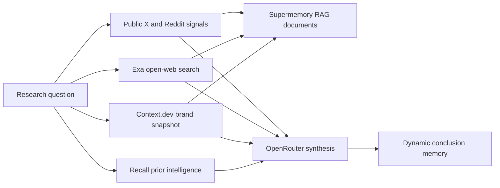

# Practical multi-provider agents

This chapter is the executable part of the wiki. The implementations live in
`src/supermemory_lab/advanced_agents.py`; live orchestration is in
`experiments/run_advanced_agents.py`; curated results are in
`evidence/2026-07-16-multi-provider-agents.md`.

## Run them

```bash
set -a
source .env.local
set +a
export PYTHONPATH=src:.

python experiments/run_advanced_agents.py intelligence
python experiments/run_advanced_agents.py tools
python experiments/run_advanced_agents.py release
python experiments/run_advanced_agents.py debug
python experiments/run_advanced_agents.py continuity
```

Raw traces go to ignored `.runs/` files. They contain bounded experiment details but should
still be treated as private operational data. The recorder redacts credential-shaped fields
and values; it is not a general-purpose PII anonymizer.

## The placement rule

Do not put everything into one vector index. Choose the representation from the information's
lifecycle.

| Information | Supermemory representation | Why |
|---|---|---|
| Confirmed identity, policy, durable preference | Direct static memory | Profile foundation; changes rarely. |
| Incident state, active project, current plan | Direct dynamic memory | Current context that should evolve or be superseded. |
| Web page, social payload, deployment snapshot, report | Document with `taskType=superrag` | Preserve source text and provenance for RAG. |
| Complete chat turn sequence | v4 conversation | Preserve roles and conversation identity. |
| Tool output needed only inside one turn | Local trace/cache | Avoid polluting long-term memory. |
| Verified lesson from a successful action | Dynamic memory with test/evidence metadata | Transfer proven knowledge to later tasks. |
| Model speculation or unverified social claim | Do not promote to static memory | Prevent compounding hallucinations. |

## 1. Competitive-intelligence agent

Providers: Supermemory + Context.dev + Exa + ScrapeCreators + OpenRouter.



Use it for competitor briefs, investment watchlists, sales account research, category maps,
and recurring market digests. The split is important:

- Context.dev gives a structured first-party brand baseline.
- Exa finds broader evidence with explicit per-query cost reporting.
- ScrapeCreators supplies public social signals; those signals are noisy and temporal.
- Raw payloads remain citable RAG evidence.
- Only the analyst conclusion becomes temporal memory, with capture time and subject metadata.

Production upgrades:

- Use stable source IDs and update existing documents when a source is recrawled.
- Add claim-level corroboration: one first-party source or two independent secondary sources.
- Store a confidence and invalidation condition with every promoted conclusion.
- Diff snapshots before invoking the model; do not pay to summarize unchanged data.
- Use Context.dev monitors for high-value domains only after measuring monitor-credit economics.

## 2. Tool-selection agent

Providers: Supermemory + Monid + Composio + OpenRouter.

The agent searches two catalogs, inspects Monid candidates, falls back to a known Composio
toolkit if natural-language search returns nothing, filters for mutation risk, and remembers
the recommendation. It deliberately does not execute a candidate during discovery.

Observed design rule: direct memory writes were visible through the profile endpoint on the
first poll, while hybrid search still missed the same decision inside a separate ten-second
window. Tool selection therefore recalls recent decisions through the profile, not a naked
`memories` search.

Use it for agents that choose among rapidly changing integrations. Store the user intent,
side-effect class, candidate schema/auth/price, rejection reasons, selected version, expiry,
and whether execution needs human approval.

Before real execution:

1. Inspect the exact input schema and price.
2. Classify it as read, reversible write, destructive write, or external message.
3. Pin a tool version when available.
4. Dry-run or validate inputs where available.
5. Require an idempotency key for retryable writes.
6. Persist the outcome only after provider confirmation.

## 3. Sandboxed debugging agent

Providers: Supermemory + SuperServe + OpenRouter.

This is the strongest causal experiment in the lab. Generated code ran inside an ephemeral
Firecracker-backed sandbox with all IPv4 egress denied. A verified project policy was saved
after the first patch passed. On a related hidden test, the stateless patch failed and the
patch given the remembered policy passed.

Use the pattern for code repair, dependency upgrades, organization-specific data cleaning,
migrations, incident runbooks, and review of untrusted snippets.

Safety requirements:

- Use an explicit language template; live `superserve/base` lacked `python3` despite the
  inspected OpenAPI description.
- Deny network by default and allow only required hosts.
- Never inject provider credentials as plain environment variables into generated-code sandboxes.
- Bound runtime, capture exit code separately from HTTP status, and always delete the VM.
- Persist only lessons backed by passing tests, not the model's initial theory.

## 4. Support-continuity agent

Providers: Supermemory + OpenRouter.

The agent stores verified facts in a tenant container and retrieves a combined static/dynamic
profile before answering. The live synthetic benchmark covered a maintenance window, active
project transition, and privacy policy: memory scored 3/3; empty tenants scored 0/3.

This is better than replaying every ticket:

- durable entitlements and communication preferences become static profile facts;
- open incident state and the active project become dynamic facts;
- manuals, policies, and old ticket bodies remain RAG documents;
- sensitive raw logs stay outside long-term memory unless explicitly governed;
- deletion requests map to precise forget operations in the customer's container.

Add authorization before retrieval. A container tag is an isolation primitive, not proof that
the caller may access the tenant.

## 5. Release-memory agent

Providers: Supermemory + Vercel + OpenRouter.

The implementation performs only reads: list projects and recent deployments, reduce the
response to bounded fields, distinguish observed state from unavailable root-cause evidence,
and store the snapshot as a RAG document.

Useful extensions include fetching build logs only for failures, correlating failure signatures
with verified remediation memories, versioning SLO changes, and requiring approval before any
rollback, redeploy, alias change, or production promotion.

## Other high-value builds

| Agent | Providers | Memory design |
|---|---|---|
| Brand-change monitor | Context.dev + Supermemory + OpenRouter | Snapshot documents; dynamic change conclusions. |
| Social issue radar | ScrapeCreators + Exa + Supermemory | Public-post RAG; clustered issue memory with confidence. |
| Repository onboarding coach | Composio or Monid + Exa + Supermemory | Repo/issue documents; developer profile and learned conventions. |
| Autonomous research notebook | Exa + Context.dev + Supermemory | Source documents only; explicit analyst conclusions. |
| Incident commander | Vercel + SuperServe + Supermemory | Live state ephemeral; verified remediation becomes memory. |
| Account-planning copilot | Context.dev + Exa + public social + Supermemory | Company RAG plus time-stamped relationship memory. |
| Workflow recommender | Monid + Composio + Supermemory | Tool evaluations, auth availability, price, prior outcomes. |
| Personal operating system | Connectors + conversations + profiles | Static identity, dynamic goals, RAG source library. |

## What not to build

- A universal “remember everything” container shared by all users and agents.
- A loop that writes its own generated answer as truth on every turn.
- An immediate handoff that assumes write acknowledgement means search visibility.
- A tool agent that treats catalog ranking as a safety or quality score.
- A social agent that promotes a single post into a durable fact.
- A production debugger that runs generated code on the host or with unrestricted egress.
