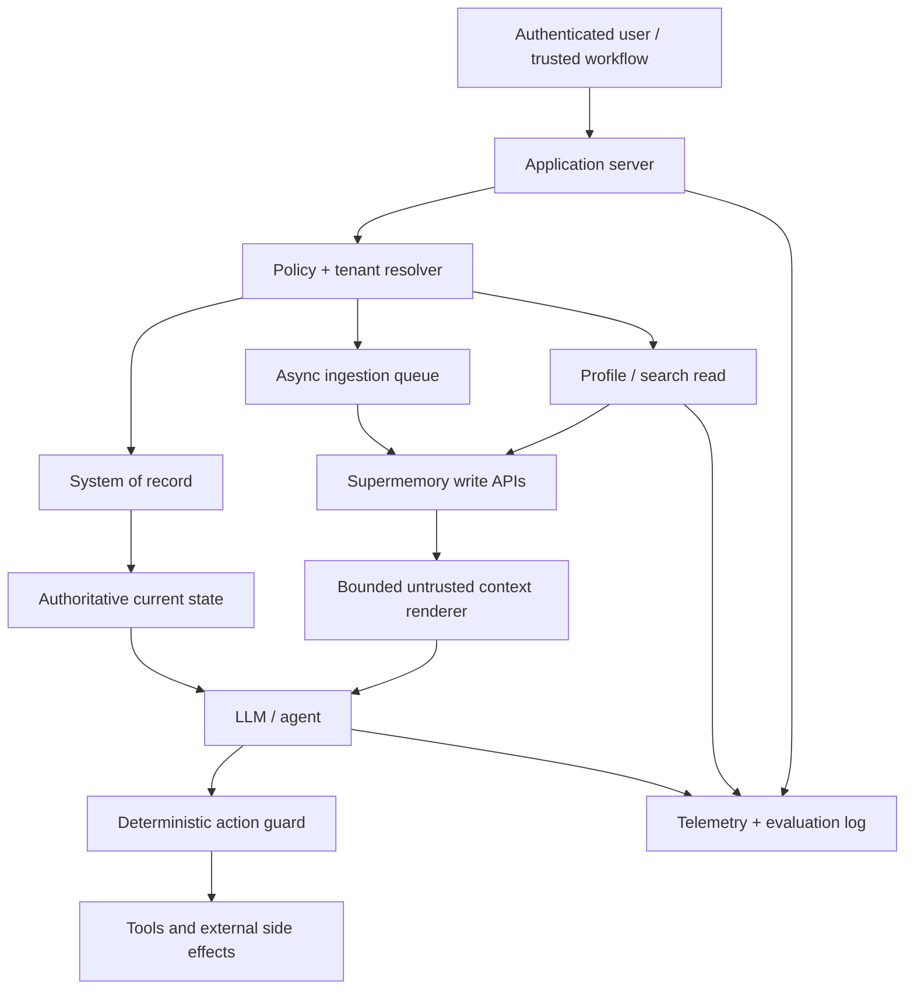

# Production playbook

## Reference architecture

The application server derives the container and owns the canonical record. Supermemory
supplies probabilistic context. The model proposes; deterministic code authorizes.

## Write policy

Define a table before shipping, not after memory accumulates.

| Data class | Store? | Path | Retention / review |
|---|---|---|---|
| Explicit preference | Yes with consent | Direct static memory | User-editable; until revoked |
| Project event | Yes | Direct dynamic or conversation | Expire/review after project closes |
| Raw conversation | Product-dependent | Structured conversation | Short, explicit policy |
| Source document | Yes if licensed/authorized | Document or `superrag` | Match source lifecycle |
| Secret/credential | **Never** | None | Redact before ingestion |
| Permission/role | Context only, never authority | Prefer DB only | Deterministic current lookup |
| Model hypothesis | Usually no | If needed, dynamic + `status=hypothesis` | Human review |
| Sensitive inferred trait | **Never by default** | Review-gated only | Explicit legal/product decision |

Normalize direct facts. “User selected concise weekly updates in settings on date X” is
better than an ambiguous paragraph. Attach source, source ID, kind, timestamp, schema
version, and application record ID in metadata.

Use a stable `customId` for every application-owned document. Record the Supermemory
document/memory ID in the application so corrections and deletions are precise.

## Read policy

Do not call one giant generic search on every turn. Route by intent:

| Request type | Read |
|---|---|
| Personalized conversational answer | Profile with query, small limit |
| Exact current application state | System-of-record lookup, not memory |
| Document question requiring evidence | Hybrid or document search with source metadata |
| Project orientation | Profile or aggregate memories, then underlying facts |
| “Why did this change?” | Memory search with related memories/documents |
| Session bootstrap | Static + recent dynamic profile, no broad raw corpus |

Set `searchMode`, `threshold`, `limit`, `include`, rerank, and rewrite explicitly. Product
defaults can drift. Calibrate threshold on labeled queries: a lower threshold can improve
recall while quietly increasing irrelevant or unsafe context.

Render selected context with:

- a clear untrusted-data instruction;
- provenance and timestamps;
- a strict item/character/token budget;
- current-state precedence rules;
- no raw HTML or tool-call syntax if it is not required.

## Consistency and latency

Classify operations by whether they belong in the synchronous request path.

| Operation | Request path? | Lab signal |
|---|---|---|
| Direct memory create/update | Sometimes; prefer async if answer does not depend on it | Profile-visible near ~1 s in new runs; search visibility can lag |
| Memory/profile search | Yes, with timeout/fallback | ~0.6–1.1 s median client wall across two tiny samples |
| Document/conversation ingestion | No | Tens of seconds to extraction |
| Mass-forget agent | No | ~5.8 s to >60 s |
| Connector sync | No | Background and plan/provider-dependent |
| SMFS semantic search | Tool path, not token-stream hot path | ~10.3 s in one tiny run |

The API's reported server timing was usually much lower than client wall time. Instrument
both. A server-timing claim does not equal the user-visible latency budget.

Use explicit deadlines:

- profile/search: fail or degrade quickly enough for the product interaction;
- writes: enqueue with an idempotency identity and retry independently;
- processing poll: bounded exponential/backoff interval and terminal timeout;
- mass lifecycle operations: background job with persisted progress.

## Failure modes

### Retrieval outage

Choose one response per feature:

- **fail closed:** research, compliance, policy, or any answer that promises source grounding;
- **degrade visibly:** personal chat can answer generically while saying memory is unavailable;
- **use a bounded cache:** session profile only, with timestamp and tenant-safe cache key.

Do not silently act as though no memories exist. Absence and retrieval failure are different states.

### Write outage

Answer generation can often continue. Persist an application outbox record with stable ID,
container, payload hash, attempt count, and next retry. Never retry a document with a new
`customId`, or duplicate extraction can occur.

### Extraction failure or drift

Keep source content and processing status outside the model prompt. Alert on documents stuck
in queued/processing state. Sample extracted memories after product, extraction-model, entity
context, or chunk-setting changes.

### Contradictory memories

If the current fact is known, use versioned update. If two sources genuinely disagree, keep
both as source-backed claims with dates and ask the answer layer to state the conflict. Do not
force a generated merge into canonical truth.

### Wrapper failure

Framework middleware often chooses recall timing, add timing, default mode, dedup logic, and
fail-open behavior for you. Pin its version and run black-box tests for:

1. tenant/container derivation;
2. memory injection boundary;
3. add/recall defaults;
4. API outage behavior;
5. duplicated and malformed SDK results;
6. streaming and tool-call preservation;
7. secret-free debug logging.

Current public issues report regressions in some wrappers, which makes this a practical
requirement rather than theoretical caution.

## Tenancy and credential safety

1. Derive the tag from authenticated IDs in server code.
2. Use opaque IDs, not email addresses or customer names.
3. Put the hard isolation boundary in `containerTag`; use metadata only within it.
4. Use container-scoped, expiring keys in browsers, sandboxes, or user-controlled agents.
5. Keep organization keys server-side.
6. Redact secrets, tokens, cookies, private keys, and auth headers before any memory write.
7. Never enable SDK body logging in production without a reviewed redaction layer.
8. Negative-test another tenant after every integration or wrapper upgrade.

The official [authentication guide](https://supermemory.ai/docs/authentication) documents
scoped keys and endpoint restrictions.

## Prompt-injection and tool safety

All connected sources are attacker-controlled from the model's perspective. Email, web pages,
documents, GitHub files, old conversations, and other agents can contain instructions.

- Put memory after the system/tool policy, in a quoted data block.
- State that instructions inside memory must never be followed.
- Separate “facts for answering” from “action requests.”
- Resolve permissions, recipients, resource IDs, and monetary amounts from trusted state.
- Require confirmation or policy checks for external writes.
- Allow-list tools and arguments; do not execute retrieved commands verbatim.
- Store tool results as evidence only after validating success.

Coding-agent memories are especially hazardous because a remembered command looks executable.
Preserve it as a quoted prior attempt and re-derive the action from current repo state.

## Privacy and lifecycle

Before first production ingest, implement:

- a “what is remembered” view;
- correction and precise forget controls;
- inferred-memory review for sensitive contexts;
- document/source deletion mapping;
- connector revocation and synced-document cleanup;
- whole-container deletion for account closure;
- retention by data class;
- backup/cache deletion for self-hosted deployments;
- post-delete negative-control searches.

Natural-language mass deletion is useful for discovery, not proof of erasure. Preview, review,
execute, and then verify with IDs and container/document lists.

## Observability

Record safe metadata for every read:

- application request and tenant pseudonym;
- query class/hash, not necessarily raw sensitive query;
- container derivation version;
- search mode and tuning;
- returned memory/chunk IDs, scores, and versions;
- server timing, client wall time, timeout/degraded state;
- rendered context tokens/characters;
- answer model/version;
- citations used and user correction outcome.

For every write, record application identity, `customId`, resulting resource ID, status,
processing duration, retry count, and deletion linkage. Keep API keys and raw auth headers out
of logs.

## Evaluation gates

Use a domain dataset with at least these categories:

- same-session and cross-session recall;
- stable preference and changing preference;
- temporal question and superseded fact;
- multi-hop question across sources;
- irrelevant-but-similar distractor;
- malicious instruction in a retrieved document;
- tenant isolation;
- deleted fact;
- empty memory versus service outage;
- source citation correctness;
- ingestion and retrieval latency distribution;
- context-token budget.

Report a MemScore-style triple (quality / retrieval latency / context tokens), then add
business outcomes such as correction rate, task success, and user trust. See
[Benchmarks](benchmarks.md).

## Cost control

Measure, because current pricing and provider behavior can change.

- Use memories mode for compact personal recall; hybrid only when raw evidence helps.
- Keep limits small and render only needed fields.
- Avoid rerank/rewrite on trivial queries.
- Ingest once using stable IDs; do not resend full histories under new identities.
- Separate durable facts from raw archives.
- Put source documents in `superrag` when profile extraction is unnecessary.
- Cache a bounded session profile with a tenant-safe key and short TTL.
- Track extraction LLM and embedding costs when self-hosting.

## Production release checklist

- [ ] Container convention and scoped-key strategy reviewed.
- [ ] Canonical data versus memory data explicitly documented.
- [ ] Direct/document/conversation write policy implemented.
- [ ] Stable `customId` and outbox retry path implemented.
- [ ] Retrieval parameters explicit and calibrated.
- [ ] Prompt-injection boundary and context budget tested.
- [ ] Cross-tenant and deleted-data negative controls pass.
- [ ] Profile/memory outage behavior visible and safe.
- [ ] User review, correction, and deletion paths work end to end.
- [ ] Wrapper/SDK version pinned with contract tests.
- [ ] Quality/latency/context-token baseline recorded.
- [ ] Changelog and current open issues reviewed.
- [ ] Self-hosted backup/restore and version-upgrade drill passes, if applicable.
