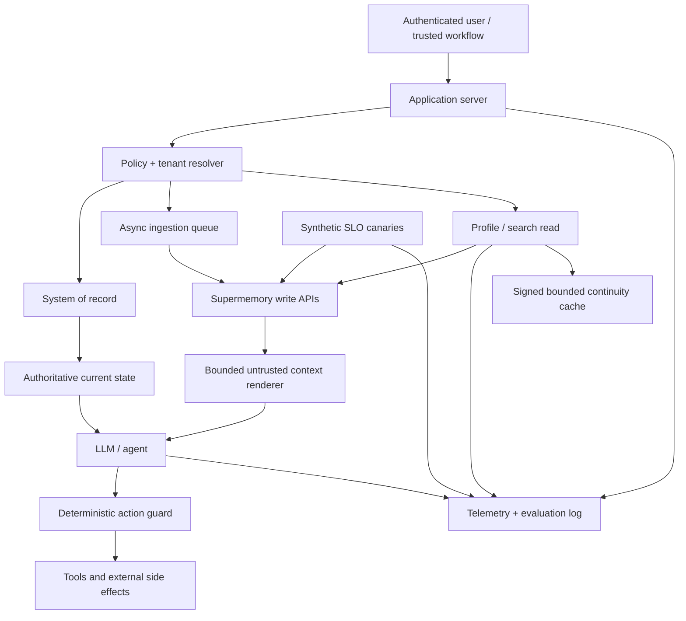

# Production playbook

## Reference architecture

The application server derives the container and owns the canonical record. Supermemory
supplies probabilistic context. The model proposes; deterministic code authorizes.

## Write policy

Define a table before shipping, not after memory accumulates.

| Data class | Store? | Path | Retention / review |
|---|---|---|---|
| Explicit preference | Yes with consent | Direct static memory | User-editable; until revoked |
| Project event | Yes | Direct dynamic or conversation | Expire/review after project closes |
| Raw conversation | Product-dependent | Structured conversation | Short, explicit policy |
| Source document | Yes if licensed/authorized | Document or `superrag` | Match source lifecycle |
| Secret/credential | **Never** | None | Redact before ingestion |
| Permission/role | Context only, never authority | Prefer DB only | Deterministic current lookup |
| Model hypothesis | Usually no | If needed, dynamic + `status=hypothesis` | Human review |
| Sensitive inferred trait | **Never by default** | Review-gated only | Explicit legal/product decision |

Normalize direct facts. “User selected concise weekly updates in settings on date X” is
better than an ambiguous paragraph. Attach source, source ID, kind, timestamp, schema
version, and application record ID in metadata.

Use a stable `customId` for every application-owned document. Record the Supermemory
document/memory ID in the application so corrections and deletions are precise.

## Durable mutation authorization

**Observed (local):** every governed mutation controller in this lab now requires an injected
`AuthorizationLedger`. The trusted application grants an exact `(scope, actor, resource hash)`;
the controller atomically consumes that grant before provider I/O. A fresh controller cannot
replay a grant already consumed by another process.

[`SqliteAuthorizationLedger`](../src/supermemory_lab/authorization.py) is the single-host
reference: it uses `BEGIN IMMEDIATE`, a unique exact-grant key, pending/consumed states, full
synchronous durability, and an HMAC over every row. Protect the database and integrity key
separately. The HMAC detects row tampering; it does not authenticate the human or workflow that
issued the grant. Production issuance must come from authenticated application policy, not a
model response or retrieved memory.

For multiple hosts, replace SQLite behind the same narrow interface with a transactional
authorization service that provides conditional one-time consume and an immutable audit trail.
Use `TestingAuthorizationLedger` only in unit tests and synthetic experiment harnesses; its
`trust_first_use` mode is intentionally not an external approval system.

## Read policy

Do not call one giant generic search on every turn. Route by intent:

| Request type | Read |
|---|---|
| Personalized conversational answer | Profile with query, small limit |
| Exact current application state | System-of-record lookup, not memory |
| Document question requiring evidence | Hybrid or document search with source metadata |
| Project orientation | Profile or aggregate memories, then underlying facts |
| “Why did this change?” | Memory search with related memories/documents |
| Session bootstrap | Static + recent dynamic profile, no broad raw corpus |

Set `searchMode`, `threshold`, `limit`, `include`, rerank, and rewrite explicitly. Product
defaults can drift. Calibrate threshold on labeled queries: a lower threshold can improve
recall while quietly increasing irrelevant or unsafe context.

Render selected context with:

- a clear untrusted-data instruction;
- provenance and timestamps;
- a strict item/character/token budget;
- current-state precedence rules;
- no raw HTML or tool-call syntax if it is not required.

For multi-scope enterprise reads, retrieve each allowed container separately or through a
multi-container scoped key, preserve the source scope in the rendered context, and apply a
trusted precedence table. Organization/project/user retrieval composition is not permission
composition.

For fresh research, distinguish three states: raw source evidence, a model synthesis, and a
policy-approved durable claim. Require publisher-aware corroboration and let any unresolved
fresh contradiction veto promotion. A memory-only fallback must be labeled stale.

For learned control policies such as model routes, persist the task family, benchmark set,
catalog/version, cost, latency, expiry, and invalidation condition. Validate the current output
contract, use a bounded fallback, and record failed outcomes so the next process can repair the
route.

For multi-agent recovery, publish compact checkpoints with workflow/task ID, sequence,
predecessor, output contract, stable idempotency ID, and an application-verifiable signature.
Reject invalid or ambiguous branches. Keep signing keys, locks, assignments, approval/replay
state, and completion in a transactional system; a signed memory proves integrity, not truth.

## Consistency and latency

Classify operations by whether they belong in the synchronous request path.

| Operation | Request path? | Lab signal |
|---|---|---|
| Direct memory create/update | Sometimes; prefer async if answer does not depend on it | Profile-visible near ~1 s in new runs; search visibility can lag |
| Memory/profile search | Yes, with timeout/fallback | ~0.6–1.1 s median client wall across two tiny samples |
| Document/conversation ingestion | No | Tens of seconds to extraction |
| Batch + Dynamic Dreaming | No | Three-document batches accepted, but exact memory readiness remained pending beyond 60–90 s in repeated small runs |
| Batch + instant SuperRAG | No | A 24-record run had exact inventory while 8 were done and 16 processing; a later barrier reached 24/24 done/searchable |
| Maximum batch | No | One exact 600-record request reached 600/600 done/searchable; an earlier 60 s timeout had unknown acknowledgement and required inventory reconciliation |
| Concurrent four-surface read | Yes, within a bounded product budget | 20/20 at eight workers passed with zero errors/leaks; per-surface concurrent p95 was ~0.59–1.43 s in one small run |
| AI profile-bucket suggestion | No; administrative path | One hosted call returned five suggestions in 25.4 s; apply only through reviewed schema evolution |
| Mass-forget agent | No | ~5.8 s to >60 s |
| Connector sync | No | Background and plan/provider-dependent |
| SMFS semantic search | Tool path, not token-stream hot path | ~10.3 s in one tiny run |

The API's reported server timing was usually much lower than client wall time. Instrument
both. A server-timing claim does not equal the user-visible latency budget.

Use explicit deadlines:

- profile/search: fail or degrade quickly enough for the product interaction;
- writes: enqueue with an idempotency identity and retry independently;
- processing poll: bounded exponential/backoff interval and terminal timeout;
- mass lifecycle operations: background job with persisted progress.

## Failure modes

### Retrieval outage

Choose one response per feature:

- **fail closed:** research, compliance, policy, or any answer that promises source grounding;
- **degrade visibly:** personal chat can answer generically while saying memory is unavailable;
- **use a bounded cache:** session profile only, with timestamp and tenant-safe cache key.

Do not silently act as though no memories exist. Absence and retrieval failure are different states.

If using a last-known-good cache, sign container, query class, bounded context, capture time,
expiry, and content hash. Require explicit stale permission and expose an application-owned
freshness banner. Never serve stale cache to high-risk classes. Open a circuit after a bounded
failure count, skip backend calls while open, and recover with a half-open probe. A cache from
another query class, tenant, expired window, or invalid signature must fail closed.

### Write outage

Answer generation can often continue. Persist an application outbox record with stable ID,
container, payload hash, attempt count, and next retry. Never retry a document with a new
`customId`, or duplicate extraction can occur.

### Extraction failure or drift

Keep source content and processing status outside the model prompt. Alert on documents stuck
in queued/processing state. Sample extracted memories after product, extraction-model, entity
context, or chunk-setting changes.

If a downstream step requires a specific normalized fact, poll that exact read separately from
document processing. On timeout, either pause visibly or write a confirmed fact directly from
the canonical source. Never let a model invent a readiness fallback.

### Contradictory memories

If the current fact is known, use versioned update. If two sources genuinely disagree, keep
both as source-backed claims with dates and ask the answer layer to state the conflict. Do not
force a generated merge into canonical truth.

For mutable source-backed answers, bind the answer to ordered current chunk IDs/hashes and
exact quotes. Re-read the source digest immediately before persistence or consequential use.
A document ID alone does not prove the answer still reflects the current revision.

### Stale learned policy

Calibration, tool choice, and retrieval settings drift. Before applying a remembered policy,
check its scope, age, model/tool version, and task family. Runtime validation owns the decision;
the policy only proposes a default. Record total latency and cost including search, failed
attempts, fallbacks, and outcome writes.

Unknown price is not zero. Keep routes with non-comparable cost in shadow evaluation until the
provider charge semantics can be normalized. Re-inspect the exact tool and validate its current
output before using a remembered route.

### Incomplete incident evidence

Separate live observations, retrieved prior lessons, public guidance, and synthetic rehearsals
in both storage metadata and prompts. A sandbox can support or refute a mechanism, but it cannot
establish the live root cause. Without authorized logs and correlation, return `UNKNOWN`; keep
rollback, redeploy, and configuration mutation behind current human/application policy.

### Wrapper failure

Framework middleware often chooses recall timing, add timing, default mode, dedup logic, and
fail-open behavior for you. Pin its version and run black-box tests for:

1. tenant/container derivation;
2. memory injection boundary;
3. add/recall defaults;
4. API outage behavior;
5. duplicated and malformed SDK results;
6. streaming and tool-call preservation;
7. secret-free debug logging.

Current public issues report regressions in some wrappers, which makes this a practical
requirement rather than theoretical caution.

## Tenancy and credential safety

1. Derive the tag from authenticated IDs in server code.
2. Use opaque IDs, not email addresses or customer names.
3. Put the hard isolation boundary in `containerTag`; use metadata only within it.
4. Use container-scoped, expiring keys in browsers, sandboxes, or user-controlled agents.
5. Keep organization keys server-side.
6. Redact secrets, tokens, cookies, private keys, and auth headers before any memory write.
7. Never enable SDK body logging in production without a reviewed redaction layer.
8. Negative-test another tenant after every integration or wrapper upgrade.

The official [authentication guide](https://supermemory.ai/docs/authentication) documents
scoped keys and endpoint restrictions.

For local and CI live runs, make credential provenance explicit. A subprocess can inherit an
older shell/runner value that correctly takes precedence over a local file yet authenticates
as the wrong or expired principal. Load the intended ignored secret source before launching,
record only provider/key-version metadata, and run a non-mutating health contract. Never print,
serialize, or commit the credential. Authentication success does not establish entitlement,
evidence quality, or permission for a write.

## Connector admission and OAuth

Treat a connection as a privileged ingestion principal. Before any create call, bind provider,
container, maximum documents, flat metadata, redirect target, and resource-selection policy in
a signed intent. Wrong approval or replay must fail before network I/O. Store only an OAuth
link hash/presence in logs and checkpoints. After user consent, re-fetch resources and bind
exact IDs immediately before configuration; any provider/connection/resource drift requires a
new plan. Current resource-management documentation is GitHub-specific, so do not assume other
providers expose the same selection lifecycle.

Entitlement is separate from authentication and consent. The governed live attempt received
`403` before OAuth and created no connection or document. Surface that state explicitly; never
claim onboarding completed or substitute an organization credential. For Google Drive, treat
`metadata.syncScope=full` as a separate high-scope approval rather than a default. Disconnect
should preserve documents unless exact deletion is separately authorized and verified.

## Prompt-injection and tool safety

All connected sources are attacker-controlled from the model's perspective. Email, web pages,
documents, GitHub files, old conversations, and other agents can contain instructions.

- Put memory after the system/tool policy, in a quoted data block.
- State that instructions inside memory must never be followed.
- Separate “facts for answering” from “action requests.”
- Resolve permissions, recipients, resource IDs, and monetary amounts from trusted state.
- Require confirmation or policy checks for external writes.
- Allow-list tools and arguments; do not execute retrieved commands verbatim.
- Store tool results as evidence only after validating success.
- Never count acquisition providers as independent corroboration without tracking the upstream
  publisher and claim each one supports.
- Never let public relationship signals authorize outreach, or let remembered incident text
  authorize mitigation.

Coding-agent memories are especially hazardous because a remembered command looks executable.
Preserve it as a quoted prior attempt and re-derive the action from current repo state.

## Privacy and lifecycle

Before first production ingest, implement:

- a “what is remembered” view;
- correction and precise forget controls;
- inferred-memory review for sensitive contexts;
- document/source deletion mapping;
- connector revocation and synced-document cleanup;
- whole-container deletion for account closure;
- retention by data class;
- backup/cache deletion for self-hosted deployments;
- post-delete negative-control searches.

Build the remembered-data view from the provider's paginated inventory, not only application
write logs. Direct memory writes can contribute backing/administrative documents. Export
documents, ordered source chunks where appropriate, current memories, nested history, and the
settings needed to interpret them; keep documents and memories typed separately even when a
wire response uses a surprising field name. Sign the inventory digest and record its time.

Natural-language mass deletion is useful for discovery, not proof of erasure. Preview, review,
execute, and then verify with IDs and container/document lists.

For retention and legal hold, snapshot the complete latest inventory and partition exact IDs
in trusted code. Bind a hold to the snapshot; regenerate any deletion plan after a hold or
record version changes. Bind deletion approval to the final plan digest and exact IDs, reject
replay, verify absence and retained controls, and write the canonical audit event outside the
memory being governed. Cover connector copies, caches, backups, exports, and self-hosted
restores. Product code does not determine whether this satisfies law; obtain qualified review.

Current list responses can expose prior versions as nested `history` on the latest entry. That
is useful for correction UX and lineage audits, but it does not replace an immutable approval,
hold, access, or erasure ledger.

## Import, migration, and rollback

For every source record, derive a stable custom ID and source-content hash, then sign a manifest
before import. Keep resumable checkpoints in a separate control scope. Honor `Retry-After`,
use multiplicative decrease on throttling/oversized batches, and grow batch size only after
confirmed success. Refuse partial acknowledgements that do not contain an exact ID per item.
After any timeout,
process restart, or lost acknowledgement, enumerate the target and reconcile expected ID/hash
to actual ID/hash; do not infer completion from request success or search hits.

Rollback must contain explicit provider document IDs, an inventory/manifest digest, expiry,
and one-time external approval. Use bounded exact bulk deletion, verify every imported ID is
absent, verify pre-existing controls remain, and emit audit outside the target. Chunk imports
and checkpoint each confirmed batch before attempting documented cardinality limits. Poll
processing state and reconcile status as well as inventory: request acceptance, target
presence, processing completion, and search readiness are separate barriers.

The current hosted schema allows 1–600 documents per batch and 1–100 exact IDs per bulk
delete. Local guards should reject 601/101. The live maximum proof reached 600/600 done and
searchable, then resumed after two deletion batches and completed six exact 100-ID batches.
This validates the boundary, not a default operating size: official ingestion guidance favors
smaller pacing, and production should adapt batch size to latency, throttling, queue depth, and
recovery cost. A timed-out POST is an ambiguous write; reconcile exact stable IDs and hashes,
and fail closed if only part of the intended set exists.

## Self-host backup and recovery

Stop the server before snapshotting. Inventory every path, file type, size, and content hash;
copy the complete `SUPERMEMORY_DATA_DIR`; compare source/backup manifests; restart the original;
then restore into a clean directory and different port. Prove the same exact memory through
search and profile and verify deletion on both copies. Restore extraction-provider environment
separately—do not bundle provider secrets into the data backup.

On macOS, normalize both `/tmp` and `/private/tmp` when supervising worker command lines. The
v0.0.5 drill passed data integrity and recovery but returned signal-derived `-5`, left workers
that needed reaping, and separately left a v3 ingest queued for 180 seconds. Keep production
on HOLD until shutdown is clean, workers are supervised, queue restart is proven, and a real
upgrade from the deployed version succeeds.

## Observability

Record safe metadata for every read:

- application request and tenant pseudonym;
- query class/hash, not necessarily raw sensitive query;
- container derivation version;
- search mode and tuning;
- returned memory/chunk IDs, scores, and versions;
- server timing, client wall time, timeout/degraded state;
- rendered context tokens/characters;
- answer model/version;
- citations used and user correction outcome.

For every write, record application identity, `customId`, resulting resource ID, status,
processing duration, retry count, and deletion linkage. Keep API keys and raw auth headers out
of logs.

Run exact synthetic canaries through profile, memories, hybrid, and document search in a
dedicated container. Record misses, forbidden tenant-marker leaks, errors, and client p50/p95
separately. Sign reports outside the measured memory. Healthy checks should not require an
LLM; an alerting model should receive metrics and error classes, never raw memory.

## Evaluation gates

Use a domain dataset with at least these categories:

- same-session and cross-session recall;
- stable preference and changing preference;
- temporal question and superseded fact;
- multi-hop question across sources;
- irrelevant-but-similar distractor;
- malicious instruction in a retrieved document;
- tenant isolation;
- deleted fact;
- empty memory versus service outage;
- source citation correctness;
- ingestion and retrieval latency distribution;
- context-token budget.

Report a MemScore-style triple (quality / retrieval latency / context tokens), then add
business outcomes such as correction rate, task success, and user trust. See
[Benchmarks](benchmarks.md).

## Cost control

Measure, because current pricing and provider behavior can change.

- Use memories mode for compact personal recall; hybrid only when raw evidence helps.
- Keep limits small and render only needed fields.
- Avoid rerank/rewrite on trivial queries.
- Ingest once using stable IDs; do not resend full histories under new identities.
- Separate durable facts from raw archives.
- Put source documents in `superrag` when profile extraction is unnecessary.
- Cache a bounded session profile with a tenant-safe key and short TTL.
- Track extraction LLM and embedding costs when self-hosting.
- Store cost observation date, currency/unit, provider-reported charge semantics, quality, and
  retry/fallback cost. Keep unknown-cost routes out of cheapest-route selection.
- Give long research both call and monetary budgets. Persist a signed progress/evidence ledger,
  count original publishers separately from acquisition APIs, and make `ready`,
  `degraded-partial`, and `memory-only-stale` explicit result types.
- Reserve model councils for proposals. Freeze one evidence manifest, validate each vote's
  citations and falsifier, preserve minority dissent, and invalidate the proposal when its
  evidence digest changes.

## Production release checklist

- [ ] Container convention and scoped-key strategy reviewed.
- [ ] Canonical data versus memory data explicitly documented.
- [ ] Direct/document/conversation write policy implemented.
- [ ] Stable `customId` and outbox retry path implemented.
- [ ] Retrieval parameters explicit and calibrated.
- [ ] Prompt-injection boundary and context budget tested.
- [ ] Cross-tenant and deleted-data negative controls pass.
- [ ] Profile/memory outage behavior visible and safe.
- [ ] User review, correction, and deletion paths work end to end.
- [ ] Wrapper/SDK version pinned with contract tests.
- [ ] Quality/latency/context-token baseline recorded.
- [ ] Changelog and current open issues reviewed.
- [ ] Learned routes/tools carry expiry, runtime contract, and bounded fallback.
- [ ] Multi-scope precedence and fresh-claim promotion are deterministic and tested.
- [ ] Correction approval is bound to exact content and protected by an external replay ledger.
- [ ] Production controllers inject a transactional authorization ledger; test-only
      trust-on-first-use authorization is impossible in deployed configuration.
- [ ] Multi-agent checkpoints are signed, idempotent, and reconciled with canonical workflow state.
- [ ] Batch/document completion is not used as a substitute for exact downstream readiness.
- [ ] Incident conclusions preserve evidence class and explicit unknown state.
- [ ] Tool policies expire, revalidate, and never treat missing price as zero.
- [ ] Multi-model votes cite an immutable manifest; invalid votes, dissent, and abstention are retained.
- [ ] Long research exposes provider failures, publisher diversity, budget, checkpoint integrity, and stale mode.
- [ ] Mastery or user scoring changes only from independently verified evidence, never the teaching model.
- [ ] Change advice is bound to current health and cannot execute deployment or override live gates.
- [ ] Legal holds invalidate prior deletion plans; exact approval, replay denial, absence verification, and external audit pass.
- [ ] Memory intake is bound to explicit subject, purpose, category, sensitivity, durability, and retention policy.
- [ ] Uploaded-source URLs are treated as temporary credentials and never stored in prompts, memory, traces, or logs.
- [ ] Delegated workers use expiring container-scoped keys; cross-scope denial, revocation, and `429` handling are tested.
- [ ] Model prose cannot author or rewrite trusted campaign, decision, citation, or authorization envelopes.
- [ ] Tool-derived skills are signed, verified in isolation, and disabled when the live contract drifts.
- [ ] Memory contamination audits hash raw content and reserve exact quarantine for deterministic high-risk findings.
- [ ] Mutable-source answers bind current chunk hashes, exact quotes, revision validity, and a pre-persist digest recheck.
- [ ] Profile bucket changes are additive, effective-schema-aware, drift-checked, reviewed, and replay-safe.
- [ ] Stale continuity is signed, query-class/risk bounded, visibly labeled, and unavailable to high-risk tasks.
- [ ] Bulk ingestion honors backpressure, checkpoints every accepted batch, polls processing, and reconciles exact hashes.
- [ ] Ambiguous batch writes reconcile stable IDs/hashes without blind retry; exact deletes stay at 100 IDs or fewer and checkpoint every batch.
- [ ] Profile/memories/hybrid/documents canaries run outside user data and hard-alert on any tenant marker leak.
- [ ] Connector entitlement, OAuth consent, selected-resource drift, sync/revoke, and document-retention/deletion behavior pass before real workspace access.
- [ ] Self-hosted stopped backup/clean restore, clean shutdown, worker supervision, queued-ingestion restart, and real version-upgrade drill pass, if applicable.
